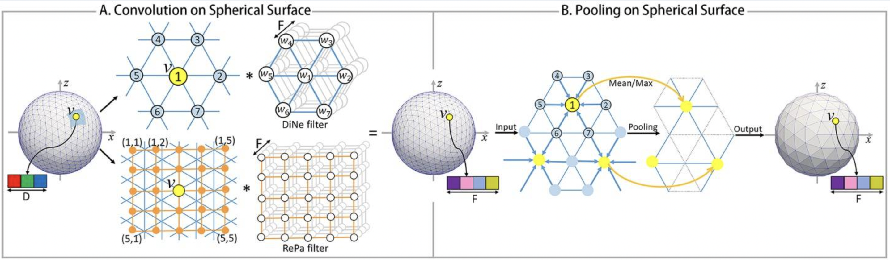
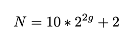
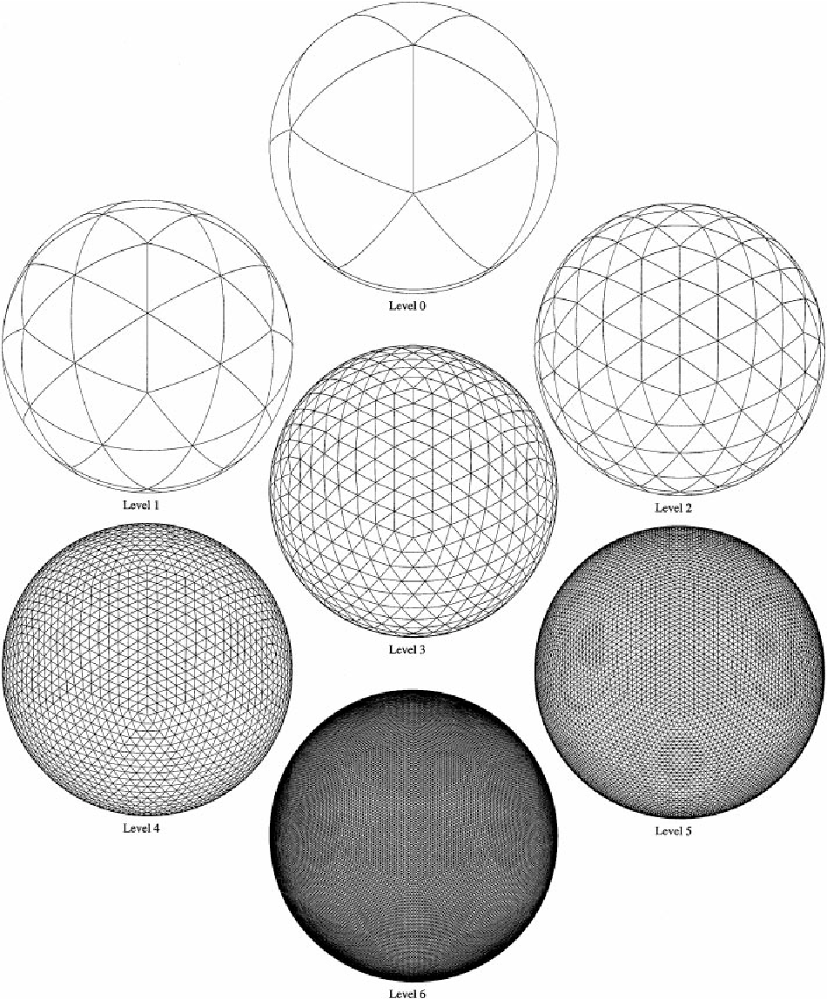
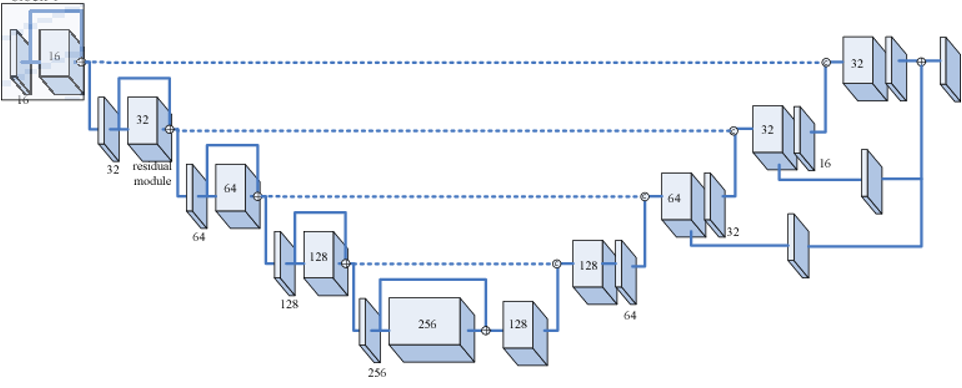
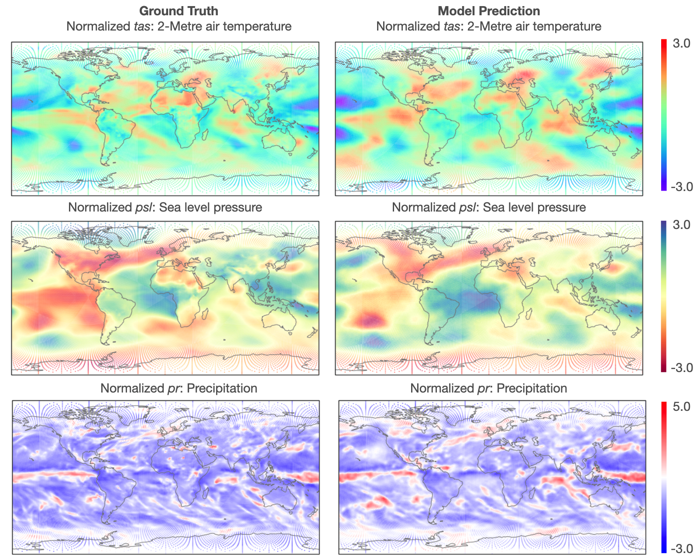

.. _aibedo_architecture:

Hybrid AI Model Architecture
============================

Our hybrid model for AIBEDO consists of two data-driven components: spherical-Unet for spatial network modeling and multi-timescale Long Short-Term Memory (LSTM) network for temporal modeling. Both components will be infused with physics-based constraints to ensure the generalizability of spatial and temporal scales. 

Spatial Data-Driven Component
-----------------------------

Spherical U-Net Architecture
~~~~~~~~~~~~~~~~~~~~~~~~~~~~

Our model framework will specifically focus on "Spherical U-net architecture". U-net is a specific form of convolutional neural network (CNN) architecture that consists of pairs of downsampling and upsampling convolutional layers with pooling operations. Unlike regular CNNs, the upsampling feature channels help the model learn the global location and context simultaneously. This technique has been proven extremely useful for biomedical applications and recently has been adopted in the earth sciences. While this is a more effective technique, one of the limitations of U-net architecture when applied to earth sciences is the inability to capture the spherical topology of data. Typically they are resolved by including boundary layer conditions/constraints. In our approach, we adopt a variant of U-net called "spherical U-net" for modeling the spatial component of AIBEDO, which is a **geodesy-aware** architecture and hence accounts for the spherical topology of Earth System data alleviating the need for external architectural constraints.

.. figure::
	u-net.png

  Figure 1. Schematic of U-net Architecture

The model uses special convolutional and pooling operations for representing spherical topology through Direct Neighbor (DiNe) convolution and spherical surface pooling operations. Also, the model takes input in the icosahedral surface for the better representation of the earth surface by resampling from the original 2-dimensional NetCDF grid data. 

  Figure 2. Spherical U-net Graph Convolution

Sampling Module
~~~~~~~~~~~~~~~

Typically, models use climate data in a uniform 2D rectangular gridded pattern. While this may suffice local/regional modeling attributes, they do not capture the physical/geodesy properties of the Earth, particularly as the focus moves away from the equator. For this reason, we developed a geodesy-aware sampling that converts 2D rectangular gridded coordinates to a geodesic grid type. There are several ways a geodesic grid can be manifested. Our method allows the modeler to choose the target gridding type between two such mesh types: (a) Icosahedral, (b) Healpix.

*Icosahedral Grids:* Icosahedral grids consist of a certain number of equiangular triangles to form a convex polygon, called Icosahedron. The triangles are formed by equally spaced grid points to form a sphere. The number of grid points are defined by their **levels** as shown in the following equation:

Here, g refers to the grid level we want to generate the mesh for, and N refers to the number of points
in the grid that forms the icosahedron.

  Figure 3. Illustration of Icosahedral meshes for different levels

.. list-table:: Table 1. Icosahedral Levels, Vertices and Spatial Resolution
   :widths: 20 20 20
   :header-rows: 1

   * - Levels
     - Vertices
     - Resolution
   * - 1
     - 42
     - 3520 km
   * - 2
     - 162
     - 1760 km
   * - 3 
     - 642 
     - 880 km
   * - 4
     - 2562
     - 440 km
   * - 5
     - 10242
     - 220 km
   * - 6
     - 40962
     - 110 km

*Healpix Grids:* Healpix is a curvilinear partition grid type made up of equal area quadrilaterals. Unlike icosahedral grids, they are manifested as pixels, and the total number of pixels in a Healpix grid is calculated as follows:

.. image::
	images/healpixeq.png

Here P is the number of pixels in the Healpix grid, and S is the grid sub-division or resolution param-
eter. Healpix is constructed in such a way that the areas of each pixel for a given sub-division is equal.

.. figure::
	images/healpixMesh.png
  :scale: 25 %

  Figure 4. Illustration of Healpix meshes for different Subdivisions

.. list-table:: Table 2. Healpix Subdivisions, Vertices and Spatial Resolution
   :widths: 20 20 20
   :header-rows: 1

   * - Subdivisions
     - Vertices
     - Resolution
   * - 4
     - 192
     - 2497 km
   * - 8
     - 768
     - 1248 km
   * - 16
     - 3072
     - 6124 km
   * - 32
     - 12288
     - 312 km
   * - 64
     - 49152
     - 156 km
   * - 128
     - 196608
     - 78 km

Interpolation Module
~~~~~~~~~~~~~~~~~~~~

We use the PyGSP library in Python to perform the grid transformation. It is commonly used for various graph operations to use in signal processing or social network analysis (e.g., Erdos-Reyni network). We first develop a 'backbone' structure of a spherical coordinate system (icosahedron, healpix, etc.). The properties of the spherical coordinates, such as levels or sub-divisions, are given as input. At this point, the coordinates are simply graph networks. In the next step, we assign latitude and longitude values to the graph network (x, y) so that they can be manifested in a geographical coordinate system. Finally, we use the raw data from reanalysis or ESM output and perform bilinear interpolation to obtain the final spherically-sampled data. 

.. figure::
	images/interpolated.png

  Figure 5. Spherical sampled and interpolated dataset from 2D-linearly gridded data

Model Library Module
~~~~~~~~~~~~~~~~~~~~~

We have created a library of models, ranging from regular Convolutional Neural Network (CNN), CNN-Autoencoder, **Vanilla** U-net to Spherical U-net architectures.This allows the modeler to explore the model performance and computational needs of different types of deep learning architectures. The sampling module is independent of the model library. There exists a function that combines the interpolated dataset obtained from the sampling module with the desired model architecture chosen by the modeler as shown in Figure. 

Multi-timescale Temporal Data-Driven Component
----------------------------------------------

A response in a climate system is rarely spontaneous due to its complex convections, teleconnections across geographical regions and feedback loops. In our model, we are incorporating two kinds of temporal components: a spatially-explicit short-term component, and spatially-aggregate long-term component. The short-term component captures the response of output variables due to changes in cloud properties in a sub-yearly resolution. We ran simple lag-response experiments and idenfified that a short-term of 3-6 months captures the climate response of temperature, surface pressure and precipitation best for the chosen input properties. We implement the short-term temporal model by extending the Spherical U-Net framework developed for the spatial component. Here, we are augmenting the Spherical U-Net architecture to incorporate the temporal dimension (concatenated along the variable vector axis) as shown in Figure 6.

  Figure 6. Temporal Spherical U-Net

This model generates the monthly output responses for different short-term input changes. To understand the long-term trend, we are aggregating the monthly responses to annual averages. We are developing these long-term trends globally as well as for each zonal region illustrated in Figure 7. In addition, we are developing a Long Short-Term Memory network models on these aggregated annual averages. These will be used to identify when the trends exactly deviate due to climate intervention experiments. For example, the loss difference of a trained LSTM between the baseline trend and climate intervention trend could pinpoint the exact timeframe as to when the deviation starts and ends. The schematic of the model operation is shown below:

  Figure 7. Schematic of AiBEDO Model Operation

Model Performance Metrics
-------------------------

In Phase 1, we are assessing the hybrid model performance on two main metrics: accuracy and speed of inference, compared to the run time of a conventional Earth system model. 

* To assess model accuracy, we will report MSE (Mean Squared Error) of the model between model predictions of output variables and the 'ground truth' (values from Earth system model output). 
* To assess regional accuracy of the model, we have divided the regions as shown in Figure 8, which consists of the tropics, midlatitudes (northern hemisphere and southern hemisphere), Arctic, and Antarctic zones. In each zone, we will report the error metrics of land and ocean areas separately using a land-sea mask attribute. 

.. figure::
	images/regions_metrics.png

  Figure 8. Region-wise Metrics
      
* As we start including the physics constraints during model training, we will assess the impact on model performance for each additional physics constraint, as well as a combination of all the constraints. These will be reported for the entire model and the sub-regions.
* Finally, once the full model is trained and used for inference, we will record the time taken to obtain the output predictions for a given input variable. This will be compared with the time taken to run different Earth System models (CESM, E3SM, etc.)

Preliminary Results
--------------------

Our initial results of the Spherical U-Net model is shown in Figure 9. We observe that the hybrid model is generally good at capturing the patterns for all three output variables. However, the model output is poor in certain regions (e.g., tropics, due to high variability). 

  Figure 9. Comparison of Ground Truth and Model Predictions for Air Temperature, Sea Level Pressure and Precipitation

To investigate this further, we plotted the errors split across regions (tropics, midlatitudes, arctic, antarctic, and over land and ocean) in Figure 10. Granular analysis of errors for different zonal regions helps us investigate how to mitigate the model performance issues, specifically, on designing physics constraints that can be incorporated accordingly. 

.. figure::
	images/prelim_result2.png

  Figure 10. Region-wise plot of errors
