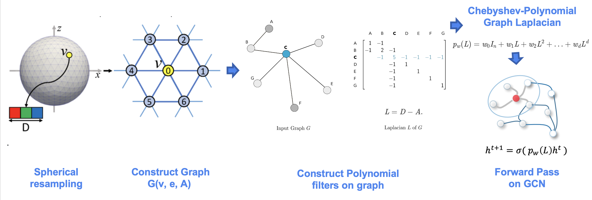

.. _aibedo_code

Base AIBEDO class
==================

Our hybrid model for AIBEDO consists of two data-driven components: a physics-aware neural network for spatial network modeling and multi-timescale Long Short-Term Memory (LSTM) network for temporal modeling. Both components will be infused with physics-based constraints to ensure the generalizability of spatial and temporal scales.
The following is the base class for the spatial modelling component.

Spatial Data-Driven Component
-----------------------------

.. automodule:: aibedo.models

.. autoclass:: BaseModel

.. autosummary::
    :toctree: generated
    :nosignatures:

    BaseModel.forward
    BaseModel.raw_predict
    BaseModel.raw_outputs_to_denormalized_per_variable_dict
    BaseModel.postprocess_raw_predictions
    BaseModel.predict

Multi-timescale Temporal Data-Driven Component
----------------------------------------------

A response in a climate system is rarely spontaneous due to its complex convections, teleconnections across geographical regions and feedback loops.
In our model, we are incorporating two kinds of temporal components: a spatially-explicit short-term component, and spatially-aggregate long-term component. The short-term component captures the response of output variables due to changes in cloud properties in a sub-yearly resolution. We ran simple lag-response experiments and idenfified that a short-term of 3-6 months captures the climate response of temperature, surface pressure and precipitation best for the chosen input properties. We implement the short-term temporal model by extending the spatial component. Here, we are augmenting the Spherical U-Net architecture to incorporate the temporal dimension (concatenated along the variable vector axis). However, this can also be implemented for the other spatial models we are developing.

This model generates the monthly output responses for different short-term input changes. To understand the long-term trend, we are aggregating the monthly responses to annual averages. We are developing these long-term trends globally as well as for each zonal region illustrated in Figure 1. In addition, we are developing a Long Short-Term Memory network models on these aggregated annual averages. These will be used to identify when the trends exactly deviate due to climate intervention experiments. For example, the loss difference of a trained LSTM between the baseline trend and climate intervention trend could pinpoint the exact timeframe as to when the deviation starts and ends. The schematic of the model operation is shown below:

.. figure::
  images/model-operation.png

  Figure 1. Schematic of AiBEDO Model Operation

Hybrid AI Model Architectures
=============================

MLP
----
.. automodule:: aibedo.models.MLP
    :members:
    :show-inheritance: False

Spherical U-Net
----------------------------

U-net is a specific form of convolutional neural network (CNN) architecture that consists of pairs of downsampling and upsampling convolutional layers with pooling operations. Unlike regular CNNs, the upsampling feature channels help the model learn the global location and context simultaneously. This technique has been proven extremely useful for biomedical applications and recently has been adopted in the earth sciences. While this is a more effective technique, one of the limitations of U-net architecture when applied to earth sciences is the inability to capture the spherical topology of data. Typically they are resolved by including boundary layer conditions/constraints. In our approach, we adopt a variant of U-net called "spherical U-net" for modeling the spatial component of AIBEDO, which is a **geodesy-aware** architecture and hence accounts for the spherical topology of Earth System data alleviating the need for external architectural constraints.

.. figure::
	images/u-net.png

  Figure 2. Schematic of U-net Architecture

The model uses special convolutional and pooling operations for representing spherical topology through Direct Neighbor (DiNe) convolution and spherical surface pooling operations. Also, the model takes input in the icosahedral surface for the better representation of the earth surface by resampling from the original 2-dimensional NetCDF grid data.

  Figure 3. Spherical U-net Graph Convolution

.. automodule:: aibedo.models.unet
    :members:
    :show-inheritance: False

.. automodule:: aibedo

Training and Testing
=====================

The following are the main functions that you want to use for training and/or testing
the AiBEDO models.

.. autosummary::
    :toctree: generated
    :nosignatures:

    train.run_model
    test.reload_and_test_model

Interface
=====================

The main
:func:`training <aibedo.train.run_model>` and
:func:`testing <aibedo.test.reload_and_test_model>` scripts above,
calls various helper functions to avoid model/data loading (and reloading) boilerplate code.
If the main training/testing scripts above are not enough for your purposes,
we strongly recommend using the interface functions below as much as possible.

.. autosummary::
    :toctree: generated
    :nosignatures:

    interface.get_model
    interface.get_datamodule
    interface.get_model_and_data
    interface.reload_model_from_config_and_ckpt

