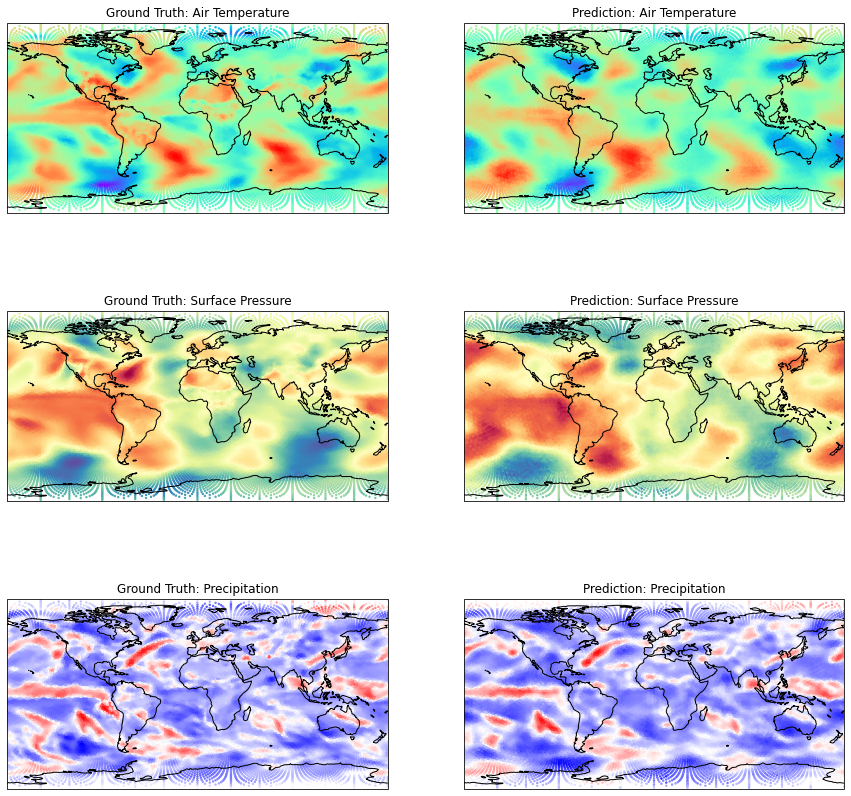

.. _aibedo_code:

Overview of Full Pipeline
=========================

This section provides directions on:

#. Preprocess ESM model output data
#. Interpolate 2D-gridded data to Spherical grids
#. Spherical U-Net Model
#. Temporal Spherical U-Net Model
#. Visualizing the Spherical U-Net output results
#. Generating Predictions
#. Long-term LSTM Model
#. Tools for interpreting and postprocessing the results

Spherical U-Net Model
~~~~~~~~~~~~~~~~~~~~~

Spherical U-Net model is developed using PyTorch package and wrapped in `Ignite <https://pytorch.org/ignite/index.html>`_ to create a scalable framework. The preprocessed file in the previous steps can be directly used to train this model. The accompanying model parameters is given in a ``config.yml`` file. Example contents of the yml file is shown below. The ``pooling_class``, ``depth``, and ``laplacian_type`` refer to the grid shape of the data type that we have generated. MODEL PARAMS include the modeling details of the Spherical U-Net model: ``partition`` refers to the train, validation and test sizes; ``batch_size`` refers to the training batch size (larger size requires more GPU memory); ``learning_rate`` is the model learning rate during training; ``n_epochs`` refers to the number of epochs. 

.. code-block:: yaml

    IMAGE PARAMS:
      pooling_class: "icosahedron"
      depth: 6
      laplacian_type: "combinatorial"

    MODEL PARAMS:
      partition: [0.8,0.1,0.1]
      batch_size: 10
      learning_rate: 0.001
      n_epochs: 5
      kernel_size: 3

    INPUT PARAMS:
      input_file: "/data_aibedo/compress.isosph.CESM2.historical.r1i1p1f1.Input.Exp8_fixed.nc"
      output_file: "/data_aibedo/compress.isosph.CESM2.historical.r1i1p1f1.Output.nc"
      output_path: "output_sunet"
      input_vars: ['clivi_pre', 'clwvi_pre', 'crelSurf_pre', 'crel_pre', 'cresSurf_pre', 'cres_pre', 'netTOAcs_pre', 'netSurfcs_pre']
      output_vars: ['tas_pre', 'psl_pre', 'pr_pre']

This file is given as command line input while running the Spherical U-Net model. The code for Spherical U-Net model can be found `here <https://github.com/kramea/aibedo/blob/sunet/skeleton_framework/sunet_compress_gpu.py>`_. 

To start model training on CPU mode, give the below command:

``python <sunet_code.py> --config-file <config file>``

To run the same code with GPUs, add the ``--gpu`` flag and provide the actual GPU number(s). For example, to run the code with the GPU 3, provide `--gpu 3`` at the end of the command line input. For running multiple GPUs (e.g. run on 7, 8, 9), add the flag ``--gpu 7 8 9`` in the command line.

Temporal Spherical U-Net Model
~~~~~~~~~~~~~~~~~~~~~~~~~~~~~~

Temporal Spherical U-Net model is similar to Spherical U-Net, in terms of implementation. The only difference between the two is the former has additional timesteps as input variables. This model includes a configuration file as input. Here, we add an additional variable ``time_length``, which introduces the lag response in models. For instance, a ``time_length`` value of ``4`` results in 3-month lag response, i.e., input variables consist of values from months t1, t2, and t3, and output variable is predicted at t4 (each of these variables are at monthly scale). An example of the configuration file for the Temporal Spherical U-Net model is shown below:

.. code-block:: yaml

    IMAGE PARAMS:
      pooling_class: "icosahedron"
      depth: 6
      laplacian_type: "combinatorial"
      time_length: 4 #>=1 for s-convlstm

    MODEL PARAMS:
      partition: [0.8,0.1,0.1]
      batch_size: 10
      learning_rate: 0.001
      n_epochs: 5
      kernel_size: 3

    INPUT PARAMS:
      input_file: "/data_aibedo/compress.isosph.CESM2.historical.r1i1p1f1.Input.Exp8_fixed.nc"
      output_file: "/data_aibedo/compress.isosph.CESM2.historical.r1i1p1f1.Output.nc"
      output_path: "output_temporal_sunet"
      input_vars: ['clivi_pre', 'clwvi_pre', 'crel_pre', 'cresSurf_pre', 'cres_pre', 'netSurf_pre', 'netTOA_pre', 'netTOAcs_pre']          
      output_vars: ['tas_pre', 'psl_pre', 'pr_pre']

    EARLY_STOPPING:
      earlystopping_patience: 30

The code for Spherical U-Net model can be found `here <https://github.com/kramea/aibedo/blob/sunet/skeleton_framework/sunetlstm_compress_gpu.py>`_. 

To start model training on CPU mode, give the below command:

``python <sunetlstm_code.py> --config-file <config file>``

To run the same code with GPUs, add the ``--gpu`` flag and provide the actual GPU number(s). For example, to run the code with the GPU 3, provide `--gpu 3`` at the end of the command line input. For running multiple GPUs (e.g. run on 7, 8, 9), add the flag ``--gpu 7 8 9`` in the command line.

Visualizing Spherical U-Net Output
~~~~~~~~~~~~~~~~~~~~~~~~~~~~~~~~~~

We use ``cartopy`` package to visualize the results of (Temporal) Spherical U-Net model. After the model is trained, the predictions of test datasets are stored as ``.npy`` files. We also need the corresponding input or output ``netCDF4`` file to read the preprocessed latitude and longitude values to plot. We use different colormaps for each output variable: ``rainbow`` for Air Temperature, ``Spectral`` for Surface Pressure and ``bwr`` for Precipitation. The Jupyter notebook for generating the visualization can be found `here <https://github.com/kramea/aibedo/blob/sunet/skeleton_framework/Viz_sunet.ipynb>`_. 

Here, the code randomly chooses a snapshot of time from the test dataset to visualize. An example visualization is shown below:

    Figure 1. Visualization of Spherical U-Net Output

Generating Predictions
~~~~~~~~~~~~~~~~~~~~~~

Once the model is trained, the weights are saved in a ``.pt`` file. This file can be used to generate predictions for new input files. The code for generating predictions can be found `here <https://github.com/kramea/aibedo/blob/sunet/skeleton_framework/gen_predictions.py>`_. To run the file, a config file needs to be given as input that consists of ``model_file`` as an additional variable. An example config file to generate predictions for the CMCC model ensemble is shown below (and can be found `here <https://github.com/kramea/aibedo/blob/sunet/skeleton_framework/config_yml/cmcc.yml>`_). 

.. code-block:: yaml

    IMAGE PARAMS:
      pooling_class: "icosahedron"
      depth: 6
      laplacian_type: "combinatorial"
      time_lag: 0 #dummy for s-convlstm
      time_length: 4 #>=1 for s-convlstm

    MODEL PARAMS:
      partition: [0.8,0.1,0.1]
      batch_size: 10
      learning_rate: 0.0001
      n_epochs: 5
      kernel_size: 3

    INPUT PARAMS:
      input_file: "/data-ssd/kramea/data_aibedo/compress.isosph.CMCC-CM2-SR5.historical.r1i1p1f1.Input.Exp8_fixed.nc"
      output_file: "/data-ssd/kramea/data_aibedo/compress.isosph.CMCC-CM2-SR5.historical.r1i1p1f1.Output.nc"
      output_path: "output_sunet"
      input_vars: [ 'crelSurf_pre', 'crel_pre', 'cresSurf_pre', 'cres_pre', 'netTOAcs_pre', 'lsMask', 'netSurfcs_pre']
      output_vars: ['tas_pre', 'psl_pre', 'pr_pre']
      model_file: "/data-ssd/kramea/data_aibedo/unet_state_6.pt"

    EARLY_STOPPING:
      earlystopping_patience: 30

To generate predictions, install all the required packages as described `here <https://github.com/kramea/aibedo/tree/sunet/skeleton_framework>`_. Then give the following command

``python gen_predictions.py --config-file cmcc.yml --gpu 0`` 

The above command generates predictions for the CMCC model ensemble using GPU 0. Multiple GPU instances can be activated by providing GPU IDs, e.g. ``gpu 1 2 4`` runs GPUs 1, 2 and 4. The predictions can also be generated without a GPU instance, but for Level 6 predictions, this might take a long time due to the input file size.
