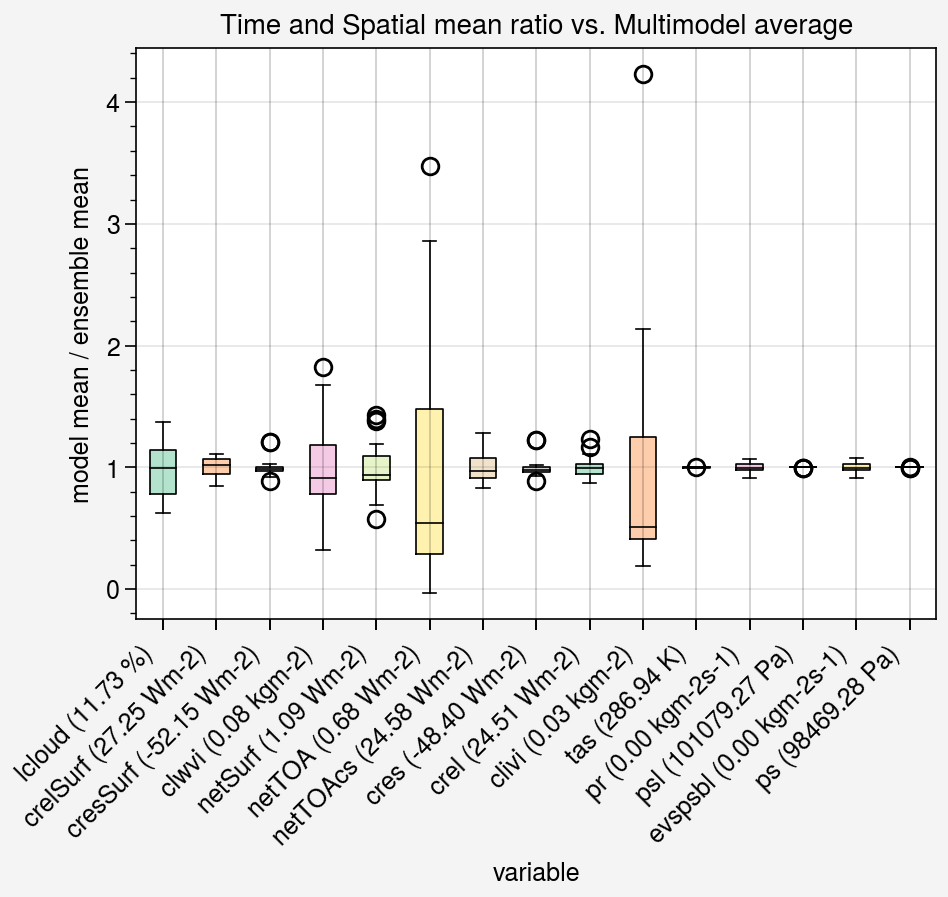
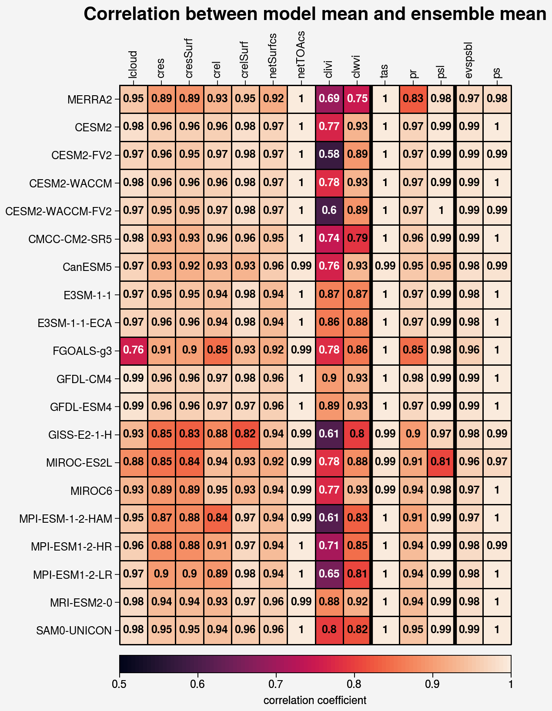
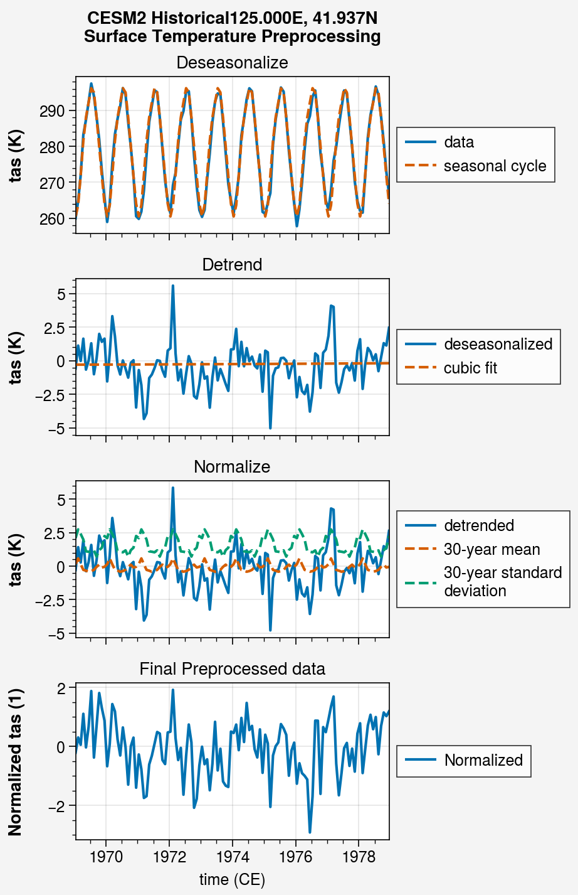
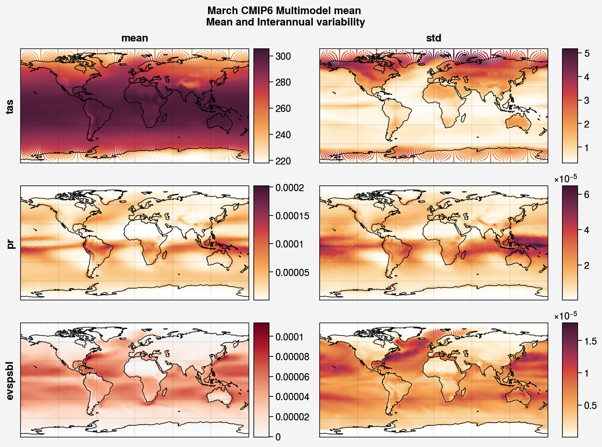

.. _aibedo_datasets:

Datasets
========

Training data
--------------

Our training data for Phase 1 consists of a subset of CMIP6 Earth System Model (ESM) outputs which had sufficient data availability on AWS to calculate the requisite input variables for our analysis (shown in Table 1. For each ESM, there are three sets of data hyper-cubes: (a) input, (b) output, and (c) data for enforcing physics constraints. Based on the initial results from our alpha hybrid model, we revised and increased the list of input variables to achieve better hybrid model performance. The updated list of input, output, and constraint variables is shown in Table 2.

.. list-table:: Table 1. Earth System Model datasets for Phase 1 training
   :widths: 20 20 20 20 20
   :header-rows: 1

   * - Model
     - N Historical
     - N ssp585
     - Lat spacing (deg)
     - Lon spacing (deg)
   * - CESM2
     - 1 
     - 0 
     - 0.942 
     - 1.2500
   * - CESM2-FV2 
     - 1 
     - 0 
     - 1.895
     - 2.5000
   * - CESM2-WACCM
     - 1 
     - 0 
     - 0.942 
     - 1.2500
   * - CESM2-WACCM-FV2
     - 1
     - 0
     - 1.895
     - 2.5000
   * - CMCC-CM2-SR5
     - 1
     - 0
     - 0.942
     - 1.2500
   * - CanESM5
     - 5
     - 0
     - 2.789
     - 2.8125
   * - E3SM-1-1
     - 1
     - 0
     - 1.000
     - 1.0000
   * - E3SM-1-1-ECA
     - 1
     - 0
     - 1.000
     - 1.0000
   * - FGOALS-g3
     - 2
     - 1
     - 2.278
     - 2.0000
   * - GFDL-CM4
     - 1 
     - 1
     - 1.000
     - 1.2500
   * - GFDL-ESM4
     - 1
     - 1
     - 1.000
     - 1.2500
   * - GISS-E2-1-H
     - 1
     - 0
     - 2.000
     - 2.5000
   * - MIROC-ES2L
     - 3
     - 0
     - 2.789
     - 2.8125
   * - MIROC6
     - 1
     - 0
     - 1.400
     - 1.4062
   * - MPI-ESM-1-2-HAM
     - 1
     - 0
     - 1.865
     - 1.8750
   * - MPI-ESM1-2-HR
     - 1
     - 0
     - 0.935
     - 0.9375
   * - MPI-ESM1-2-LR
     - 1
     - 0
     - 1.865
     - 1.8750
   * - MRI-ESM2-0
     - 1
     - 0
     - 1.121
     - 1.1250
   * - SAM0-UNICON
     - 1
     - 0
     - 0.942
     - 1.2500

.. list-table:: Table 2. Variable list and descriptions
   :widths: 20 20 60
   :header-rows: 1

   * - Category
     - Variable
     - Description
   * - Input
     - clwvi
     - Mass of cloud liquid water in a column
   * - Input
     - clivi
     - Mass of cloud ice water in a column 
   * - Input
     - cres
     - TOA Cloud radiative effect in shortwave
   * - Input
     - cresSurf
     - Surface Cloud radiative effect in shortwave
   * - Input
     - crel
     - TOA Cloud radiative effect in longwave
   * - Input
     - crelSurf
     - Surface Cloud radiative effect in longwave
   * - Input
     - netTOAcs 
     - TOA radiation without clouds (clear-sky)
   * - Input
     - netSurfcs
     - Net Clearsky Surface radiation
   * - Input
     - lcloud
     - Cloud fraction averaged between 1000 hPa and 700 hPa
   * - Output
     - tas
     - 2-metre air temperature
   * - Output
     - psl
     - Sea level pressure
   * - Output
     - pr
     - Precipitation
   * - Constraint
     - ps 
     - Surface pressure
   * - Constraint
     - evspsbl
     - Evaporation
   * - Constraint
     - heatconv
     - Convergence of vertically integrated heat flux

The ESM data are pooled together to form the training and testing datasets for our hybrid model. However, it is important to note there are substantial differences in the climatologies and variability of some of the chosen input variables across models (Figure 1). In particular, global average cloud liquid water content, cloud ice water content, and net top of atmosphere radiation vary more across ESMs than other variables. The former two are the result of differences in cloud parameterizations between ESMs, while the latter is likely due to uncertainties in the overall magnitude of anthropogenic forcing over the historical period. Comparing spatial correlation scores (Figure 2), shows net TOA radiation fields are very similar across models while the spatial pattern of cloud ice and water content varies substantially. Such variations represent the inter-ESM uncertainty in the representation of the climate. However, many of these ESM differences are largely removed during preprocessing described below.

	Figure 1. Box plot of spread of ESM global and time means of selected input, output, and constraint variables divided by their respective multi-model ensemble mean. Ensemble mean values shown in parentheses in the x-labels

	Figure 2. Pearson-R spatial correlations between ESM time average and ESM ensemble mean fields (for data remapped to level 5 Sphere-Icosahedral grid) across the models (rows) and variables (columns), showing the inter-ESM uncertainty in the climatologies of the selected input, output, and constraint variables

Reanalysis
-----------
In addition to ESM data, we also employ "reanalysis" datasets as validation datasets. Namely the `Modern-Era Retrospective analysis for Research and Applications, Version 2 (MERRA2) <https://gmao.gsfc.nasa.gov/reanalysis/MERRA-2/>`_ and the `ECMWF Reanalysis version 5 (ERA5) <https://www.ecmwf.int/en/forecasts/datasets/reanalysis-datasets/era5>`_.
Reanalyses are models which ingest large quantities observational data to estimate the historical evolution of the atmosphere, thus providing an estimate of a wide range of atmospheric variables over the entire globe.
While these data are exactly the same as observational data, they are the best method of obtaining physically consistent and complete climate data representing the recent past of the Earth's atmosphere.

Preprocessing
--------------

Each of the above data hyper-cubes are preprocessed before ingestion into the hybrid model as follows:

#. **Remove seasonal cycle or "Deseasonalizing"**: We perform this process to remove any trends in the season to prepare a seasonal stationary time series data. 
#. **Remove trend or Detrend**: We fit a third degree polynomial to remove any trend in data over time. This removes secular trends (for example, rising temperatures as atmospheric CO$_2$ increases) and allows the model to be trained on fluctuations due to internal variability, rather than the forced response. 
#. **Normalized anomalies**: The anomaly at each grid point is calculated relative to a running mean that is computed over a centered 30-year window for that grid point and month. Anomalies are normalized by dividing by the standard deviation of the anomaly over the same 30-year window for that grid point and month.
#. **Remap data to Sphere-Icosahedral**: Use `Climate Data Operators <https://code.mpimet.mpg.de/projects/cdo/embedded/index.html#x1-6460002.12.1>`_ to bilinearly remap disparate ESM grids to uniform level-6 Sphere-Icosahedral grid.

  Figure 3. Example preprocessing for a surface air temperature data point.

Physics Constraints
--------------------
 
To strengthen the generalisability of the AiBEDO model, we include "weak" physics-based constraints on the output to penalize unphysical results from the model.

Constraint 1. Climate energy budget
~~~~~~~~~~~~~~~~~~~~~~~~~~~~~~~~~~~~~~~~~~~
In this constraint, the energy is budgeted, between the heat storage and radiative fluxes at TOA, on longer climate-relevant timescales. 
 
.. math:: 
  \sum_{t}^{> 1 yr} \sum_{lat=90S}^{90N}\sum_{lon=180W}^{180E}(\Delta {R^{TOA}_{lat, lon}} - \lambda_{ECS}T_{lat, lon}\Delta A_{lat, lon}) = 0

where :math:`\Delta R^{TOA}` is heat storage/top of atmosphere radiative imbalance, :math:`\lambda_{ECS}` feedback constant, :math:`T` is surface temperature and :math:`A` is the area of the cell. 
For the :math:`\lambda_{ECS}` feedback constant, we use the CESM2 equilibrium feedback computed from a 2xCO\ :sub:`2` simulation.
The Planck, water vapour, cloud, and albedo feedbacks are provided as seasonally varying zonal averages. 
We sum all the feedback components together, map across longitude values, and then interpolate to the Sphere-Icosahedral grid.
Constraint 1 applies over longer time scales than the other constraints thus requires several months of data to compute. 
Note also that we are applying the feedback parameter :math:`\lambda_{ECS}` from one ESM (CESM2) regardless of the source of the training data. 
This weakens the constraint as there is significant uncertainty within CMIP6 in the magnitude of the feedback parameter (Zelinka et al., 2020).

Constraint 2. **Tropical atmospheric energy budget**
~~~~~~~~~~~~~~~~~~~~~~~~~~~~~~~~~~~~~~~~~~~~~~~~~~~~~~~~~~~~~
Unlike the climatic counterpart, this atmospheric budget balances the contributions from upward net radiative heat flux at the TOA and SFC to the heat convergence in the tropics, at the model prediction timescales.

.. math:: 

  \sum_{lat=30N}^{30N} \sum_{lon=180W}^{180E}(LP - R_{TOA} + R_{SFC} + SH + Q)_{lat,lon} \Delta A_{lat, lon} = 0   

where :math:`L` is the latent heat of vaporization (:math:`2.4536 10^6` J/kg), :math:`P` is the precipitation, :math:`SH` is the sensible heat flux, :math:`R_{TOA}` is the upwelling surface radiation, :math:`R_{TOA}` is the upwelling surface radiation, and :math:`Q` is the convergence of vertically integrated dry static energy (DSE) flux.
Functionally, :math:`R^{TOA}` and :math:`R^{SFC}` can be calculated as the sum of the long wave and shortwave radiation at the top of atmosphere (TOA) and surface (SFC).
:math:`Q` is computed at each grid cell as

.. math:: 
  Q =- -\frac{1}{g}\nabla \cdot \sum_{p=0}^{p_s} (c_p T + g Z) \vec{u} \Delta p

which is the horizontal convergence of heat energy into the grid cell and balances the radiation and heat fluxes into the cell. 
As we only use monthly mean data, we do not have information about the sub-monthly covariance of the variables used to compute :math:`Q`, thus the balance only holds assuming this sub-monthly covariability (A.K.A. "transient eddy" effects) are negligible. 
This is approximately true in tropical regions, where mean flow dominates, but does not hold in the subtropics and poleward, where transient eddies play a much larger role.
Thus, we compute this constraint only in the tropics.

Constraint 3. **Global moisture budget**
~~~~~~~~~~~~~~~~~~~~~~~~~~~~~~~~~~~~~~~~~~~~~~~~~~~~~~~~~~~~~
This relationship balances the moisture flux in to (evaporation) and out of (precipitation) the atmosphere over the globe at each time step, thus ensuring conservation of moisture in the atmosphere.

.. math:: 
  \sum_{lat=90S}^{90N} \sum_{lon=180W}^{180E} (P-E)_{lat,lon} \Delta A_{lat,lon} = 0

where :math:`P` is the precipitation and :math:`E` is the evaporation.

Constraint 4. **Non-negative precipitation**
~~~~~~~~~~~~~~~~~~~~~~~~~~~~~~~~~~~~~~~~~~~~~~~~~~~~~~~~~~~~~
A simple yet relevant constraint is to ensure negative precipitation (:math:`P`) values are set to zero during model training. This will then ensure maximum penalty for the erring grid point when compared to the ground truth data.

.. math:: 
  P \ge 0, lat \in [90S, 90N], lon \in [180E, 180W]

Constraint 5. **Global atmospheric mass budget**
~~~~~~~~~~~~~~~~~~~~~~~~~~~~~~~~~~~~~~~~~~~~~~~~~~~~~~~~~~~~~
Using the hydrostatic balance assumption, surface pressure can be used as a proxy for the mass of the atmosphere. This simple constraint ensures atmospheric mass conservation summed over the globe at each time step.

.. math:: 
  \sum_{lat=90S}^{90N}\sum_{lon=190W}^{180E}(P_s)_{lat,lon} \Delta A_{lat, lon} = 0

where :math:`P_s` is the surface pressure.

Denormalizing
~~~~~~~~~~~~~~~
As the AiBEDO model deals with normalized variables while the constraint require the variables in their original units (and with physically realistic spatial variations), we must "denormalize" the model output to apply the constraints.
The training data fed into the model is detrended and deseasonalized, thus filtering out all low frequency information. However, the climatology and variability change as anthropogenic climate change intensifies.
Furthermore, the data is derived from a range of models with differing mean climatology and interannual variability patterns.
Thus, passing through the climatology and variability associated with the model and time period of training time step provides additional information about model uncertainty and GHG forced climate change that is undesirable when training in a Fluctuation Dissipation framework.
As a result, we select a single reference climatology and variability with which to denormalize the model output for calculating constraints.
This reference can thus be thought to represent the climatology and variability of the AiBEDO model.

We select the CMIP6 multi-ESM ensemble average climatology and variability for the denormalization (though we might equally consider using reanalysis data). 
The average variability is computed as the square root of the average of the interannual variances across the ESMs.
Note that we must still deal with a seasonal cycle in the climatology. A simple approach is to use a single month or season as the basis for the denormalization. More sophisticated methods of incorporating seasonal information are currently under consideration.

	Figure 4. March climatology and interannual variability in the CMIP6 multi-model average.

References
--------------------

Zelinka, M.D., Myers, T.A., McCoy, D.T., Po‐Chedley, S., Caldwell, P.M., Ceppi, P., Klein, S.A., Taylor, K.E., 2020. Causes of Higher Climate Sensitivity in CMIP6 Models. Geophys. Res. Lett. 47. https://doi.org/10.1029/2019GL085782
