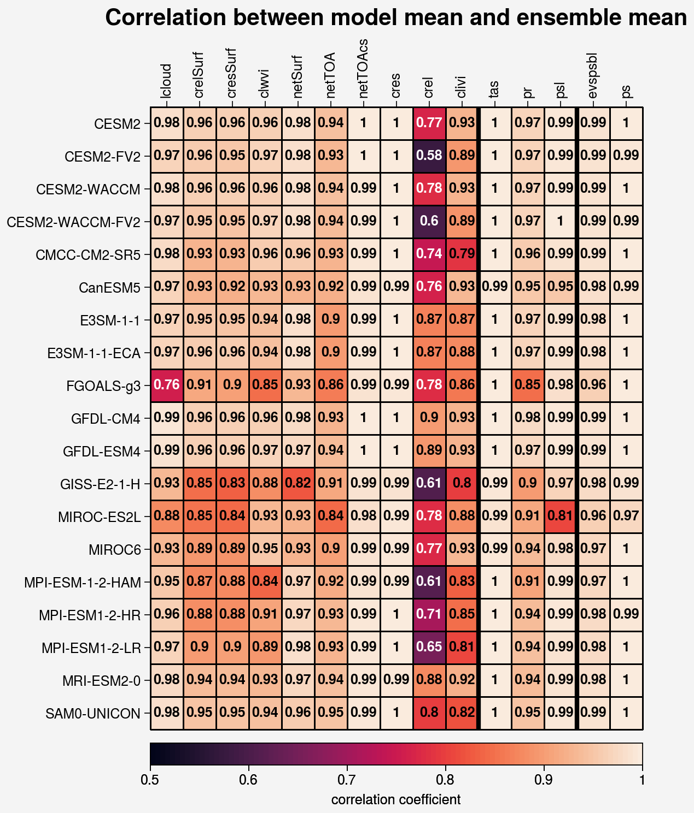

.. _aibedo_datasets:

Datasets
========

Training data
~~~~~~~~~~~~~~

Our training data for Phase 1 consists of a subset of CMIP6 Earth System Model (ESM) outputs which had sufficient data availability on AWS to calculate the requisite input variables for our analysis (shown in Table 1. For each ESM, there are three sets of data hyper-cubes: (a) input, (b) output, and (c) data for enforcing physics constraints. Based on the initial results from our alpha hybrid model, we revised and increased the list of input variables to achieve better hybrid model performance. The updated list of input, output, and constraint variables is shown in Table 2.

.. list-table:: Table 1. Earth System Model datasets for Phase 1 training
   :widths: 20 20 20 20 20
   :header-rows: 1

   * - CESM2
     - 1 
     - 0 
     - 0.942 
     - 1.2500
   * - CESM2-FV2 
     - 1 
     - 0 
     - 1.895
     - 2.5000
   * - CESM2-WACCM
     - 1 
     - 0 
     - 0.942 
     - 1.2500
   * - CESM2-WACCM-FV2
     - 1
     - 0
     - 1.895
     - 2.5000
   * - CMCC-CM2-SR5
     - 1
     - 0
     - 0.942
     - 1.2500
   * - CanESM5
     - 5
     - 0
     - 2.789
     - 2.8125
   * - E3SM-1-1
     - 1
     - 0
     - 1.000
     - 1.0000
   * - E3SM-1-1-ECA
     - 1
     - 0
     - 1.000
     - 1.0000
   * - FGOALS-g3
     - 2
     - 1
     - 2.278
     - 2.0000
   * - GFDL-CM4
     - 1 
     - 1
     - 1.000
     - 1.2500
   * - GFDL-ESM4
     - 1
     - 1
     - 1.000
     - 1.2500
   * - GISS-E2-1-H
     - 1
     - 0
     - 2.000
     - 2.5000
   * - MIROC-ES2L
     - 3
     - 0
     - 2.789
     - 2.8125
   * - MIROC6
     - 1
     - 0
     - 1.400
     - 1.4062
   * - MPI-ESM-1-2-HAM
     - 1
     - 0
     - 1.865
     - 1.8750
   * - MPI-ESM1-2-HR
     - 1
     - 0
     - 0.935
     - 0.9375
   * - MPI-ESM1-2-LR
     - 1
     - 0
     - 1.865
     - 1.8750
   * - MRI-ESM2-0
     - 1
     - 0
     - 1.121
     - 1.1250
   * - SAM0-UNICON
     - 1
     - 0
     - 0.942
     - 1.2500

.. list-table:: Table 2. Variable list and descriptions
   :widths: 20 20 60
   :header-rows: 1

   * - Category
     - Variable
     - Description
   * - Input
     - clwvi
     - Mass of cloud liquid water in a column
   * - Input
     - clivi
     - Mass of cloud ice water in a column 
   * - Input
     - cres
     - TOA Cloud radiative effect in shortwave
   * - Input
     - cresSurf
     - Surface Cloud radiative effect in shortwave
   * - Input
     - crel
     - TOA Cloud radiative effect in longwave
   * - Input
     - crelSurf
     - Surface Cloud radiative effect in longwave
   * - Input
     - netTOA
     - Net TOA radiation (all-sky) 
   * - Input
     - netTOAcs 
     - TOA radiation without clouds (clear-sky)
   * - Input
     - netSurf
     - Net Surface radiation
   * - Input
     - netSurfcs
     - Net Clearsky Surface radiation
   * - Input
     - lcloud
     - Cloud fraction averaged between 1000 hPa and 700 hPa
   * - Output
     - tas
     - 2-metre air temperature
   * - Output
     - psl
     - Sea level pressure
   * - Output
     - pr
     - Precipitation
   * - Constraint
     - ps 
     - Surface pressure
   * - Constraint
     - evspsbl
     - Evaporation
   * - Constraint
     - heatconv
     - Convergence of vertically integrated heat flux

The ESM data are pooled together to form the training and testing datasets for our hybrid model. However, it is important to note there are substantial differences in the climatologies and variability of some of the chosen input variables across models (Figure 1). In particular, global average cloud liquid water content, cloud ice water content, and net top of atmosphere radiation vary more across ESMs than other variables. The former two are the result of differences in cloud parameterizations between ESMs, while the latter is likely due to uncertainties in the overall magnitude of anthropogenic forcing over the historical period. Comparing spatial correlation scores (Figure 2), shows net TOA radiation fields are very similar across models while the spatial pattern of cloud ice and water content varies substantially. Such variations represent the inter-ESM uncertainty in the representation of the climate. However, many of these ESM differences are largely removed during preprocessing described below.

.. image::
	images/box_mm_spread_1.png

Preprocessing
~~~~~~~~~~~~~

Each of the above data hyper-cubes are preprocessed before ingestion into the hybrid model as follows:

#. **Remove seasonal cycle or "Deseasonalizing"**: We perform this process to remove any trends in the season to prepare a seasonal stationary time series data. 
#. **Remove trend or Detrend**: We fit a third degree polynomial to remove any trend in data over time. This removes secular trends (for example, rising temperatures as atmospheric CO$_2$ increases) and allows the model to be trained on fluctuations due to internal variability, rather than the forced response. 
#. **Normalized anomalies**: The anomaly at each grid point is calculated relative to a running mean that is computed over a centered 30-year window for that grid point and month. Anomalies are normalized by dividing by the standard deviation of the anomaly over the same 30-year window for that grid point and month.

Data required for Physics Constraints
~~~~~~~~~~~~~~~~~~~~~~~~~~~~~~~~~~~~~~~
 
To strengthen the generalisability of the AiBEDO model, we include "weak" physics-based constraints on the output to penalize unphysical results from the model.

1. Atmospheric mass balance : global, annual mean sea level pressure (psl) is equal to zero
2. Atmospheric moisture balance : global, annual mean precipitation minus evaporation (pr - evspsbl) is equal to zero
3. Precipitation low bound : Precipitation cannot be less zero
4. Local Tropical Atmosphere moisture budget : Precipitation + sensible heat flux = atmospheric cooling (pr + hfss - (rsus + rlus - rsds - rlds + rsdt - rlut) = 0)
5. Energy Balance : (forcing = feedbacks + ET convergence + storage)  