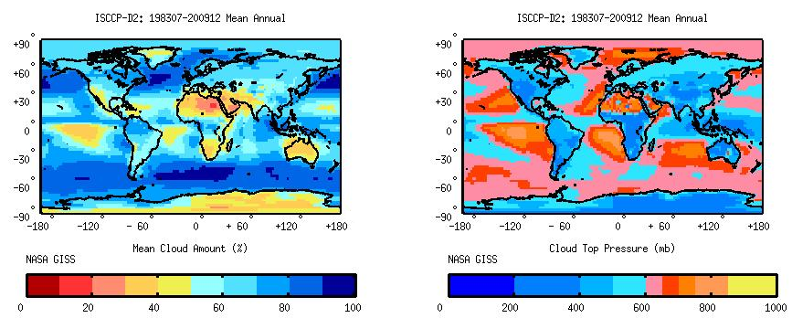
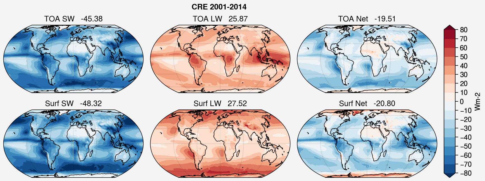
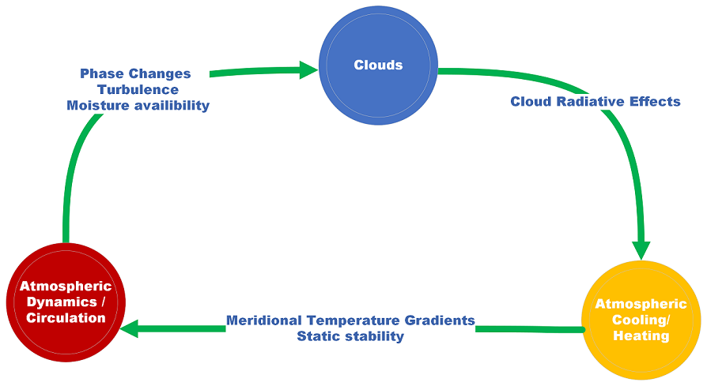

.. _aibedo_dynamics:

.. _aibedo_clouds:

Climate Dynamics
================

Clouds and Circulation
----------------------

Clouds
~~~~~~
As defined in the AMS Glossary of Meteorology, a cloud is a visible aggregate of minute water droplets and/or ice particles in the atmosphere above the earth's surface\ :sup:`1`. Clouds form in the atmosphere as a result of the condensation of water vapor present in the atmosphere. At any point in time, about 70% of the earth is covered by one or other type of cloud. Clouds are important modifiers of the energy balance of the earth\ :sup:`2`, and are also tracers of the large-scale atmospheric circulation. How clouds modify the very atmospheric circulation in which they are embedded is less well understood, and is an area of active research.
Clouds exhibit both spatial and temporal variability. Tropical regions of ascending motion are dominated by high-level clouds while subtropical regions of descending motion are dominated by low-level clouds\ :sup:`3`. Figure 1 shows the observed climatological spatial pattern of cloud amount and cloud top pressure from the International Satellite Cloud Climatology Project (ISCCP) dataset. Cloud cover is most substantial over tropical convective regions as well as mid-latitude storm tracks (Figure 1, left panel). Deserts regions generally have fewer clouds, and oceans have more cloud cover than nearby land regions.  The annual mean climatology of cloud top pressure (Figure 1, right panel) reveals that thick clouds with high tops are observed over convergence zones in the deep tropics and storm tracks over the midlatitudes, while subtropical regions of descent are characterized by low-level clouds. 

   Figure 1 Annual climatology of cloud amount (\%, left panel) and cloud top pressure (mb, right panel) using ISCCP-D2 data (1983-2009).
 

Circulation controls of clouds
~~~~~~~~~~~~~~~~~~~~~~~~~~~~~~
The large-scale circulation influences clouds profoundly, so much so that clouds may be considered tracers of the atmospheric circulation. Over longer time scales, the distribution of clouds is modulated by the internal variability of climate, i.e. clouds fluctuate with changes in large-scale atmospheric dynamic and thermodynamic states.

1.    Mid-tropospheric vertical velocity is the fundamental factor that controls the clouds in the atmosphere. High clouds dominate the ascent regions of the tropical deep convective belt as well as regions of slant-wise convection at the midlatitude storm tracks. On the other hand, low clouds form in descending regions of subtropical anticyclones and cold-air sectors of midlatitude storms/fronts\ :sup:`3`.
2. Another important factor that controls clouds is static stability: increase in lower tropospheric stability is associated with increased low clouds, and decrease in upper tropospheric stability with increase in number of high clouds\ :sup:`4`.
3. Colder SSTs and cold air advection also control the distribution of low-level clouds\ :sup:`5,6`.

Cloud effects on circulation
~~~~~~~~~~~~~~~~~~~~~~~~~~~~
Clouds alter the radiation budget at the surface as well at top of the atmosphere (TOA) through scattering, absorption, and emission of radiation. The impact of clouds on circulation is mediated through cloud radiative effects (CRE). CRE quantifies the effect of clouds on radiation and is calculated as the difference between all-sky and clear-sky radiative fluxes\ :sup:`2`. 

Clouds reflect a significant amount of incoming solar radiation, which increases the planetary albedo and cools the planet.  This effect is known as the shortwave CRE (CRES). The top-of-atmosphere (TOA) and surface CRES is most pronounced over the midlatitude storm tracks, over subtropical oceanic regions where low clouds dominate, and at the Inter-Tropical Convergence Zone (ITCZ) of the deep tropics (Figure 2, left column). 

Clouds also absorb and emit longwave radiation. Clouds absorb the longwave radiation emitted by the earth and emit it to space at lower temperatures from the cloud top, which warms the planet in a manner similar to the greenhouse effect. The longwave CRE (CREL) depends on cloud altitude. Deep, high-level clouds cause the greatest TOA CREL in the deep tropics, and low-level clouds cause the greatest surface CREL in the subtropics (Figure 2, middle column). Globally clouds exert the net cooling effect at TOA and the surface (Figure 2, right column). The global net cloud radiative forcing is about 21 W m-2, about four times the magnitude of the forcing due to doubling atmospheric CO\ :sub:`2`\ :sup:`2`.

CREs, and fluctuations therein, may either cool or warm the atmosphere causing, changes in the atmospheric stability, meridional temperature gradients, and wind shear.  These, in turn, modify the large-scale dynamical circulation\ :sup:`7-10`.  

   Figure 2 Climatology of TOA (first row) and Surface (second row) CRE calculated using CERES-EBAF4.1 data. The numbers at top of each plot show the global mean value.

Coupling between clouds and the circulation
~~~~~~~~~~~~~~~~~~~~~~~~~~~~~~~~~~~~~~~~~~~
The large-scale circulation drives the formation and distribution of clouds, and clouds affect the large-scale circulation through CREs. This cloud - large-scale circulation coupling (Figure 3) is a less understood part of the climate system, and is an area of ongoing research in the climate science community. 
 

   Figure 3 Schematic representing cloud circulation coupling.

A multitude of planetary-scale atmospheric circulation changes is anticipated with the increase in greenhouse gas concentrations in the atmosphere\ :sup:`11-16`. These circulation changes will determine the regional distribution of climate change impacts, including regional precipitation change. However, climate model projections of the circulation response to increasing atmospheric greenhouse gas involve large uncertainties at the regional level. The fundamental challenge of climate science involves reducing this uncertainty, a substantial fraction of which is due to cloud feedbacks and the climate response to this feedback. The poor agreement of models in simulating cloud feedbacks likely stems from an incomplete understanding of how clouds and the large-scale circulation interact.

CMIP6 cloud and circulation biases
~~~~~~~~~~~~~~~~~~~~~~~~~~~~~~~~~~~~

Fluctuation Dissipation Theorem
-------------------------------

Fluctuation Dissipation Theorem (FDT) for the climate system posits that the climate system response to relatively small perturbations can be estimated using a climate response operator derived from the statistics of unforced climate variability. That is, the response of a variable :math:`X` to a forcing :math:`\delta f` can be estimated as 

.. math::
    L\delta X = \delta f

where :math:`L` is typically a linear response function (LRF) representing all relevant processes connecting :math:`f` to :math:`X` (Majda et al., 2010). The LRF is estimated by integrating

.. math::
    L_{FDT} = - \left[\int_0^{\infty } \mathbf{C}(\tau)\mathbf{C}(0)^{-1} d\tau \right]^{-1}

for covariance matrices :math:`C` and time lag :math:`\tau`. To effectively estimate the LRF, it is critical to have a large sample of internal variability with which to estimate the covariance matrices. 

We are therefore aiming to use the internal variability relationships between cloud variables and target climate variables such as surface temperature and pressure to estimate the response to MCB. However, there are significant shortcomings of the linear FDT method (Liu et al., 2018). Thus, we instead use the philosophy of the FDT and replace the LRF with an ML model, allowing a more comprehensive determination of the relationships between variables and possibly capturing non-linear interactions. This nevertheless makes the assumption that the relationships between modes and variables does not change as the climate changes, which we assume hold for the levels of warmings in our study (historical and near future warming).

References
----------

“Cloud - Glossary of Meteorology.” Accessed March 31, 2022. https://glossary.ametsoc.org/wiki/Cloud .

Ramanathan, VLRD, R. D. Cess, E. F. Harrison, P. Minnis, B. R. Barkstrom, E. Ahmad, and D. Hartmann. “Cloud-Radiative Forcing and Climate: Results from the Earth Radiation Budget Experiment.” Science 243, no. 4887 (1989): 57–63.

Tselioudis, George, William Rossow, Yuanchong Zhang, and Dimitra Konsta. “Global Weather States and Their Properties from Passive and Active Satellite Cloud Retrievals.” Journal of Climate 26, no. 19 (2013): 7734–46.

Li, Ying, David WJ Thompson, Graeme L. Stephens, and Sandrine Bony. “A Global Survey of the Instantaneous Linkages between Cloud Vertical Structure and Large-Scale Climate.” Journal of Geophysical Research: Atmospheres 119, no. 7 (2014): 3770–92.

Norris, Joel R., and Sam F. Iacobellis. “North Pacific Cloud Feedbacks Inferred from Synoptic-Scale Dynamic and Thermodynamic Relationships.” Journal of Climate 18, no. 22 (2005): 4862–78.

Myers, Timothy A., and Joel R. Norris. “On the Relationships between Subtropical Clouds and Meteorology in Observations and CMIP3 and CMIP5 Models.” Journal of Climate 28, no. 8 (April 15, 2015): 2945–67. https://doi.org/10.1175/JCLI-D-14-00475.1 .

Bony, Sandrine, Bjorn Stevens, Dargan MW Frierson, Christian Jakob, Masa Kageyama, Robert Pincus, Theodore G. Shepherd, Steven C. Sherwood, A. Pier Siebesma, and Adam H. Sobel. “Clouds, Circulation and Climate Sensitivity.” Nature Geoscience 8, no. 4 (2015): 261–68.

Voigt, Aiko, Nicole Albern, Paulo Ceppi, Kevin Grise, Ying Li, and Brian Medeiros. “Clouds, Radiation, and Atmospheric Circulation in the Present-Day Climate and under Climate Change.” Wiley Interdisciplinary Reviews: Climate Change 12, no. 2 (2021): e694.

Albern, Nicole, Aiko Voigt, and Joaquim G. Pinto. “Cloud-Radiative Impact on the Regional Responses of the Midlatitude Jet Streams and Storm Tracks to Global Warming.” Journal of Advances in Modeling Earth Systems 11, no. 7 (2019): 1940–58. https://doi.org/10.1029/2018MS001592.

Su, Hui, Jonathan H. Jiang, J. David Neelin, T. Janice Shen, Chengxing Zhai, Qing Yue, Zhien Wang, et al. “Tightening of Tropical Ascent and High Clouds Key to Precipitation Change in a Warmer Climate.” Nature Communications 8, no. 1 (June 7, 2017): 15771. https://doi.org/10.1038/ncomms15771 .

Huang, Ping, Shang-Ping Xie, Kaiming Hu, Gang Huang, and Ronghui Huang. “Patterns of the Seasonal Response of Tropical Rainfall to Global Warming.” Nature Geoscience 6, no. 5 (2013): 357–61.

Lu, Jian, Gabriel A. Vecchi, and Thomas Reichler. “Expansion of the Hadley Cell under Global Warming.” Geophysical Research Letters 34, no. 6 (2007).

Barnes, Elizabeth A., and Lorenzo Polvani. “Response of the Midlatitude Jets, and of Their Variability, to Increased Greenhouse Gases in the CMIP5 Models.” Journal of Climate 26, no. 18 (2013): 7117–35.

Grise, Kevin M., and Sean M. Davis. “Hadley Cell Expansion in CMIP6 Models.” Atmospheric Chemistry and Physics 20, no. 9 (2020): 5249–68.

Xia, Yan, Yongyun Hu, and Jiping Liu. “Comparison of Trends in the Hadley Circulation between CMIP6 and CMIP5.” Science Bulletin 65, no. 19 (2020): 1667–74.

Jin, Chunhan, Bin Wang, and Jian Liu. “Future Changes and Controlling Factors of the Eight Regional Monsoons Projected by CMIP6 Models.” Journal of Climate 33, no. 21 (2020): 9307–26.

Majda, Andrew J., Boris Gershgorin, and Yuan Yuan. “Low-Frequency Climate Response and Fluctuation–Dissipation Theorems: Theory and Practice.” Journal of the Atmospheric Sciences 67, no. 4 (April 1, 2010): 1186–1201. https://doi.org/10.1175/2009JAS3264.1.

Liu, Fukai, Jian Lu, Oluwayemi Garuba, L. Ruby Leung, Yiyong Luo, and Xiuquan Wan. “Sensitivity of Surface Temperature to Oceanic Forcing via Q-Flux Green’s Function Experiments. Part I: Linear Response Function.” Journal of Climate 31, no. 9 (May 1, 2018): 3625–41. https://doi.org/10.1175/JCLI-D-17-0462.1.

