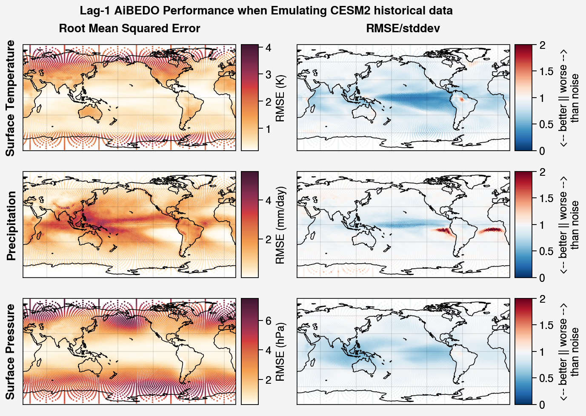
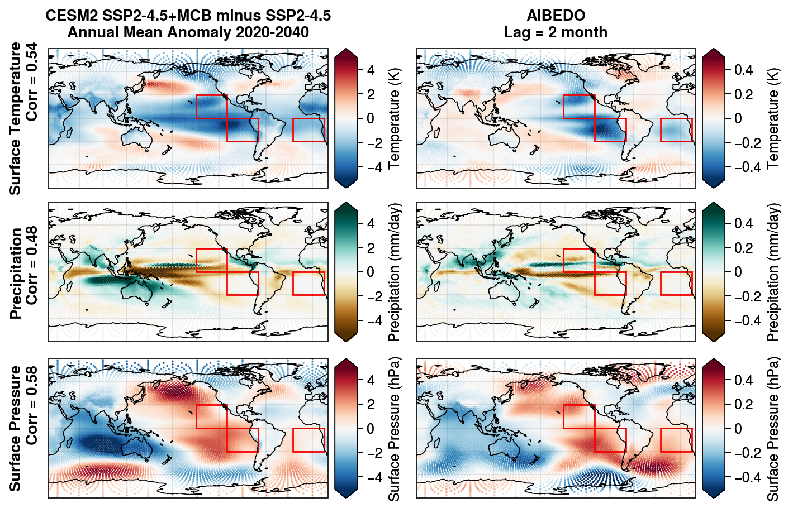

Evaluation
==========

Model Performance Metrics
-------------------------

In Phase 1, we are assessing the hybrid model performance on two main metrics: accuracy and speed of inference, compared to the run time of a conventional Earth system model.

* To assess model accuracy, we will report MSE (Mean Squared Error) of the model between model predictions of output variables and the 'ground truth' (values from Earth system model output).
* To assess regional accuracy of the model, we have divided the regions as shown in Figure 1, which consists of the tropics, midlatitudes (northern hemisphere and southern hemisphere), Arctic, and Antarctic zones. In each zone, we will report the error metrics of land and ocean areas separately using a land-sea mask attribute.

.. figure::
	images/regions_metrics.png

  Figure 1. Region-wise Metrics

* As we start including the physics constraints during model training, we will assess the impact on model performance for each additional physics constraint, as well as a combination of all the constraints. These will be reported for the entire model and the sub-regions.
* Finally, once the full model is trained and used for inference, we will record the time taken to obtain the output predictions for a given input variable. This will be compared with the time taken to run different Earth System models (CESM, E3SM, etc.)

Comparing the map of time-RMSE to the internal variability noise, we find that AiBEDO does substantially better than noise in predicting at low latitudes, but is near noise at higher latitudes (Fig. 2). Thus, it appears the model struggles to emulate the climate noise in the noisier midlatitudes, but is fairly effective at emulating relationships at lower latitudes.

  Figure 2. Root mean squared error (left column) for Lag-1 AiBEDO model trained on CESM2 LE data and same RMSE divided by interannual standard deviation (right column)

Validation of Marine Cloud Brightening effect
---------------------------------------------

To evaluate the performance of the lagged model in application to forced responses, we compare the AiBEDO response to CESM2. After extensive testing, we found that a spherical icosahedral multilayer perceptron (MLP) model provides the best performance for time-lagged projections. MCB forcing is calculated from CESM2 Fixed-SST simulations and the radiation anomalies are applied to a time series of preprocessed CESM2 data, in order to ensure the perturbed fields are not too far out of the training distribution. The MCB effect is then calculated by taking the difference between the AiBEDO output for the background time series and the output for the perturbed time series. 

We compare this AiBEDO response to CESM2 simulations with equivalent MCB forcing in three tropical/subtropical regions, the Southeast Pacific (SEP), Northeast Pacific (NEP), and Southeast Atlantic (SEA) in order to validate the perturbation effect of the model versus an actual ESM response in Figure 3. We find that the lag = 2 months AiBEDO well reproduces the pattern of response to the MCB forcing, particularly at low latitudes. However, the magnitude of the response at a given time lag is too small, thus we need to integrate the output of multiple AiBEDO models trained at time lags to obtain an estimate of the response magnitude.

  Figure 3. Effect of MCB forcing in the SEP, NEP, and SEA in CESM2 simulations (left column) versus AiBEDO-MLP projects at lag=2 for surface temperature (top row), precipitation (middle row), and surface pressure (bottom row).