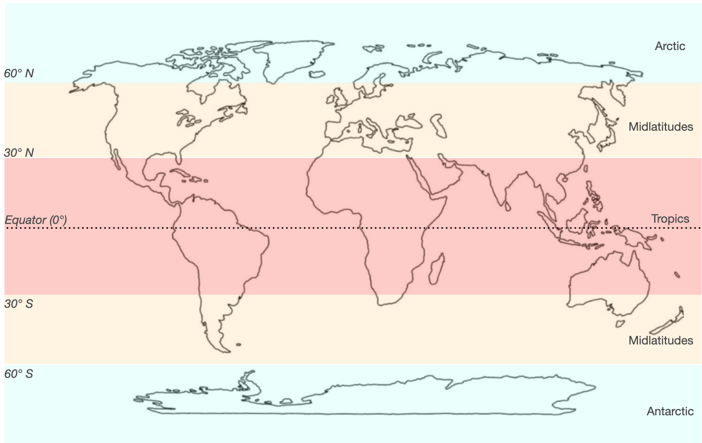

Evaluation
==========

Model Performance Metrics
-------------------------

In Phase 1, we are assessing the hybrid model performance on two main metrics: accuracy and speed of inference, compared to the run time of a conventional Earth system model.

* To assess model accuracy, we will report MSE (Mean Squared Error) of the model between model predictions of output variables and the 'ground truth' (values from Earth system model output).
* To assess regional accuracy of the model, we have divided the regions as shown in Figure 1, which consists of the tropics, midlatitudes (northern hemisphere and southern hemisphere), Arctic, and Antarctic zones. In each zone, we will report the error metrics of land and ocean areas separately using a land-sea mask attribute.

  Figure 1. Region-wise Metrics

* As we start including the physics constraints during model training, we will assess the impact on model performance for each additional physics constraint, as well as a combination of all the constraints. These will be reported for the entire model and the sub-regions.
* Finally, once the full model is trained and used for inference, we will record the time taken to obtain the output predictions for a given input variable. This will be compared with the time taken to run different Earth System models (CESM, E3SM, etc.)
