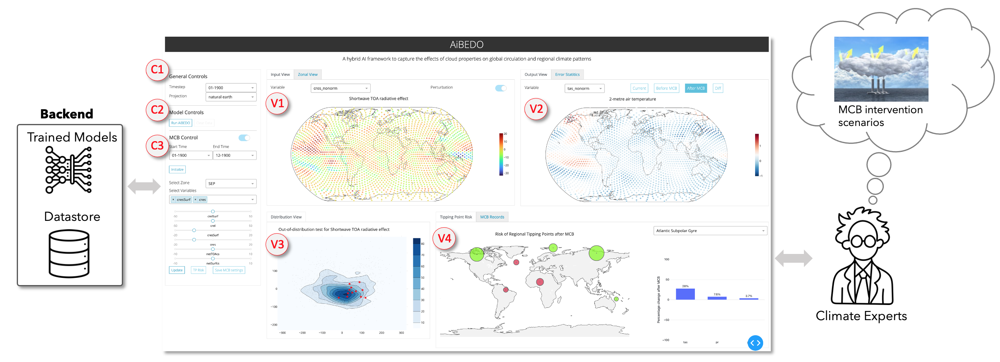
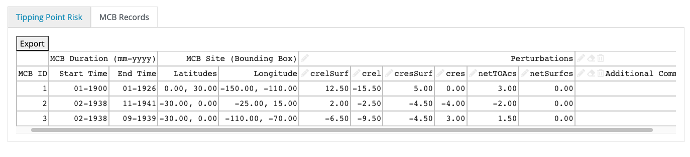

.. _aibedo_interface:

Visual Analysis System
======================

Our frontend interactive visual analysis (VA) system lets the climate scientists visualize and directly interact with the trained hybrid AI models. The VA system is developed following the requirements and guidelines expressed by our team of climate experts. The multi-panel design lets the experts load different ESM data, interactively run the trained hybrid model in the backend and visualize the model predictions and inputs using popular geospatial projection schemes. Specific control knobs are provided to facilitate what-if investigation to test different MCB type climate intervention hypothesis directly from our VA system. Users can select a specific geospatial zone and decide to perturb the different input variables using these controls to instantaneously see the predicted outcome of cloud property perturbations.

Code Repository: https://github.com/subhashis/aibedoviz

Figure 1 shows a high-level overview of the VA system layout. The key functionalities of the system are annotated and explained below:

* C1. General Controls:
   #. Timestep: Select the month of the input data to analyze.
   #. Projection: Geospatial projection scheme for visualization in input and output panels (i.e., V1 and v2). Default: ``natural earth``

* C2. Model Controls:
   #. Run AiBEDO: Execute the trained hybrid AI model with base input if MCB control (C3) is not turned-on, else run the model with MCB settings and explained below.
   #. Clear Data: Clear the output buffers from memory.
* C3. MCB Controls:
   #. Switch: Turn on to activate MCB experiments. Default: ``Off``
   #. Start Time: MCB start month
   #. End Time: MCB end month
   #. Initialize: Create a fresh copy of data for MCB perturbation.
   #. Select Zone: Predefined MCB sites: ``SEP``, ``NEP``, ``SEA``
   #. Select Variables: Select multiple input variables and perturb their values at MCB sites using the corresponding sliders.

   
   Figure 1 High-level overview of the VA system.
   
* V1. Input View: 
   * Visualize the input fields by selecting the desired input variable from the dropdown menu. 
   * The Perturbation switch when ``on`` shows the input fields with MCB perturbation, else it shows the base input field for the timestep selected in General Controls (C1)
* V2. Output View: 
   * Visualize the output fields from different model run scenarios:
   * Current: Results of AiBEDO models with the base timestep as the input.
   * Before MCB: Results of AiBEDO models for the MCB duration without any perturbation applied.
   * After MCB: Results of AiBEDO models for the MCB duration with MCB perturbation seetings applied.
   * Diff: The difference in output fields before and after MCB experiments.
* V3. Distribution View:
   * Display the density distribution of input fields for the full dataset being loaded. Desired input variable can be selected using the variable dropdown in panel V1.
   * To detect any distribution shift because of MCB pertrurbations, the selected MCB duration fields are projected (red dot) on top of the original data distribution.
* V4. Tipping Point Risk:
   * Highlight the risk of climate tipping point at 7 geogragical sites after the MCB experiment. Red indicates the risk criteria is satisfied at that site else it is colored green.
   * ``TP Risk`` button at the MCB Controls panel (C3) updates this view for every MCB experiment
   * The bar chart on the right summarizes the average percentage increase/decrease of the output fields after MCB application at these 7 differents sites
* V4[Tab]. MCB Records:
   * Progressively store the desired MCB recordings in data table which can be later exported to track important MCB configurations.
   * ``Save MCB Settings`` button at the MCB Controls panel (C3) adds the current settings to the data table
   

   Figure 2 MCB records tab in the VA system.
   
