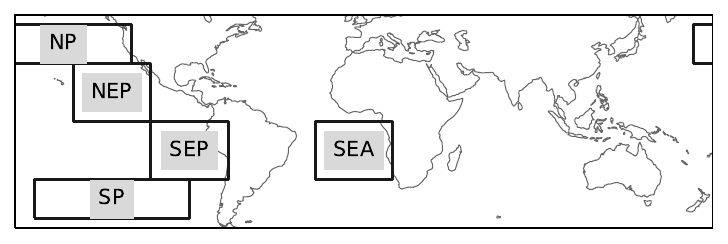
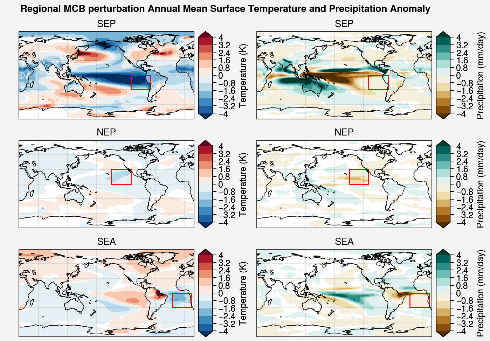

.. _aibedo_mcb:

Marine Cloud Brightening
========================

---------------------------
Background and Introduction
---------------------------

The AIbedo project will use the AI model to evaluate some possible
environmental impacts of a climate intervention strategy\ :sup:`1`,\
:sup:`2` known as Marine Cloud Brightening (MCB). Climate Intervention
(sometimes also called "climate engineering' or geoengineering) refers
to a proposed deliberate intervention in the climate system to counter
some impacts of global warming from increased greenhouse gas
concentrations. Two main classes of climate intervention have been
proposed: the first operates by reducing the concentration of
greenhouse gases (called 'Carbon Dioxide Removal'), and the other
attempts a cooling of the planet by introducing small changes in the
planet's energy budget (these strategies are often called 'sunlight reflection
methods' or SRM). MCB\ :sup:`3` falls into the second category of methods,
attempting to increase the reflectivity, areal extent, and persistence
of marine clouds that scatter sunlight back to space (i.e. to
“brighten” them) by introducing additional sea-spray particles nearby
those clouds. Sea spray particles are very efficient nuclei for cloud
drop formation, and introducing additional particles in excess of ambient concentrations influence
the number of droplets that form in those clouds. Cloud reflectivity is proportional to the surface area of the cloud drops so increasing the number of cloud drops (and decreasing the cloud drop radius) has a big impact on cloud brightness. Changing the number of cloud droplets also affects the rate
that clouds grow, precipitate and decay, affecting the lifetime of clouds and their frequency of occurance. So called 'ship tracks' (cloud
streaks that form following emission of pollution particles from
freighters) provide dramatic evidence of the impact of particle on
cloud properties. There are a few regions of the planet with cloud
systems believed to be particularly susceptible to particle emissions.

Our project investigates the impact of MCB on model climate in 3
stages: During **Stage 1** we will use CESM2 to participate in a small
intercomparison activity with a couple of other model groups to explore impacts of MCB in marine
regions known to be susceptible to changes in cloud condensation
nuclei, and evaluate model responses.  The experimental design for
the study is inspired by previous studies of Jones et al (2009\ :sup:`4`, 2012\ :sup:`5`), and Rasch et al (2009\ :sup:`6`), but it is
intended to allow a more systematic evaluation of the regional effects
of MCB to facilitate comparison between models, and allow a comparison
with another climate intervention technique known as Stratospheric
Aerosol Injection (SAI). In **Stage 2** we will compare the responses of
the full Global Climate Models (GCM) with the predicted responses produced using using the
AIbedo ML model. In **Stage 3** we will use the AIbedo model to assess
the impact of MCB on events relevant to tipping points.

------------------------------------
Stage 1: Climate Model Perturbations
------------------------------------

The intercomparison activity if intended to look for common, and differing impacts of MCB in three different climate models (the DOE E3SM model, the CESM2 (done within this project), and the United Kingdom Meteorological Office model (UKMO-ESM).The study uses 9 sets of simulations to
sstablish some baseline simulations for each model in the presence of
recent greenhouse gas and pollutant emissions, land use and land cover
changes, and then use a projection of possible changes in these
quantities by assuming a specific “Shared Socioeconomic Pathway” (SSP)
identifying how global society, demographics and economics might
change those quantities over the rest of this century. The activity will use
SSP2-4.5, a moderate projection assuming that social, economic, and
technological trends for addressing CO2 emissions do not shift
markedly from historical patterns. Development and income growth
proceeds unevenly, with some countries making relatively good progress
while others fall short of expectations.

The study then explores and evaluates climate responses in each model
over that same period if some cloud features (reflectivity, areal
extent, and precipitation) in specific regions are perturbed, to
identify what impacts might occur to temperature fields, winds, ocean
currents, precipitation, etc.

A targeted cooling will be established for five geographic regions with
a total cooling that is intended to counteract some of the warming
associated with doubling of CO2. These regions are located in the
subtropical ocean adjacent to land masses where extensive and
persistent stratus and trade cumulus clouds are found, as well as
some other marine low clouds in midlatitudes.  The regions are
intended to cover 15-20% of the global ocean, with a target of a
total global forcing magnitude of 1.8 W/m2, which is about half the
forcing associated with a doubling of CO2. The cooling is intended to
help in “shaving off” the peak in warming that is projected to occur
in all but the most ambitious scenarios that address GHG emissions
for the century if no intervention methods are employed.

We plan to first do the study with E3SM, then repeat it with CESM, and the UKMO Earth System model.
The project will first introduce perturbations in the cloud fields in the CESM2 model in 5 regions of the planet (see figure 1), and then introduce similar changes in the AIbedo AI model to see how accurate the AI model is reproducing/predicting the response of the GCM.

   
   Figure 1. Region definitions for MCB perturbations

The specific science questions to be addressed by these experiments are:

* Q1. What are the climatic consequences of increasing the albedo in regions of the planet known for persistent marine cloud distributions?
* Q2. Are the climate effects linear with respect to the regions? 
* Q3. How do the climate responses scale with the amplitude of the forcing? 
* Q4. Is the response to MCB sensitive to the background state of the atmosphere? Interannual, decadal, longer? 
* Q5. Are consistent signatures seen across models? e.g. Amazon precipitation? Impacts on sea ice and polar climate?
* Q6. What is the variability of the climate response?
* Q7. Can one “optimize” the MCB to achieve particular climate goals?

~~~~~~~~~~~~~~~~~~~~~~~~
Completed MCB Experiments
~~~~~~~~~~~~~~~~~~~~~~~~

The AiBEDO team will participate in this inter-model comparison by contributing CESM2 simulations (outlined in Table 1) with perturbed cloud droplet number concentrations. In addition to the science conducted as part of the above described study, these simulations will serve as validation datasets for the AiBEDO response to cloud perturbations. As these simulations will have strong, out of sample perturbations and well sampled climate responses, they are the ideal test bed for evaluating the AiBEDO's ability to project climate responses to large perturbations in cloud droplet number of the kind required for MCB.

.. list-table:: Experiment descriptions for CESM2 experiments completed to date (Oct 11, 2022)
   :widths: 20 20 20 20 20
   :header-rows: 1

   * - Experiment ID
     - Simulation Nickname
     - Model Configuration
     - Description
     - Length (model years x ensemble members)
   * - E1 
     - MCB Calibration R1 + R2 + R3
     - Fixed-SST
     - Short atmosphere-only experiments aimed at identifying CDNC values in NE Pac (R1), SE Pac (R2), and SE Atl (R3) required to achieve -1.8Wm-2 forcing 
     - 10 x 5
   * - E2
     - CESM Control
     - Fully Coupled
     - Control SSP2-4.5 experiments
     - 2015 to 2065 x 17
   * - E3
     - CESM Control + NEP forcing
     - Fully Coupled
     - SSP2-4.5 experiments with CDNC forcing applied in the NE tropical Pacific
     - 2015 to 2065 x 3
   * - E4
     - CESM Control + SEP Forcing
     - Fully Coupled
     - SSP2-4.5 experiments with CDNC forcing applied in the SE tropical Pacific
     - 2015 to 2065 x 3
   * - E5
     - CESM Control + SEA Forcing
     - Fully Coupled
     - SSP2-4.5 experiments with CDNC forcing applied in the SE tropical Atlantic
     - 2015 to 2065 x 3
   * - E6
     - CESM Control + NEP, SEP, and SEA Forcing
     - Fully Coupled 
     - SSP2-4.5 experiments with CDNC forcing applied in the NE Pac, SE Pac, and SE Atl
     - 2015 to 2065 x 3 plus 2065-2075 rebound simulations

Surface temperature and precipitation responses from experiments 3, 4, and 5 are shown in Figure 2. These anomaly patterns will be used to verify the pattern of climate response to MCB forcing in AiBEDO.

  
  Figure 2. Surface temperature (left column) and precipitation (right column) responses to MCB-like perturbations in the SEP (top row), NEP (middle row), and SEA (bottom row). Calculated as the difference between the MCB perturbed simulations and the SSP2-4.5 baseline over the 2030-2060 period.

..   
	Question for Kalai and Hansi:

	do you want a table of experiments?

	do you want figure showing shiptracks?

--------------------------------------
Stage 2: AiBEDO ML Model Perturbations
--------------------------------------

Following successful training and validation of AiBEDO, we will use the model to generate cloud perturbation scenarios targeting key regional climate signals that may be associated with climate tipping points. These scenarios will then be tested in MCB CDNC perturbation experiments to verify the AiBEDO results and further study the physical mechanisms underlying the responses.

Table 2 describes examples of proposed regional climate responses we will target using AiBEDO and CESM2 experiments.

.. list-table:: Table 2. Regional perturbations targeted using AiBEDO
   :widths: 20 20 20
   :header-rows: 1

   * - Region
     - Associated tipping point/climate response of interest
     - Variables changes
   * - West Antarctic
     - West Antarctic ice sheet collapse
     - Antarctic surface temperature increase
   * - North Atlantic
     - Atlantic Meridional Overturning Circulation (AMOC) collapse
     - North Atlantic precipitation increase; Arctic surface temperature increase
   * - Arctic
     - Greenlandic ice sheet collapse; Arctic sea ice loss
     - Arctic surface temperature increase
   * - Amazon
     - Southern Amazon drought and rainforest loss
     - South American precipitation decrease
   * - NH Mid-latitudes
     - Jet shift
     - Midlatitude sea level pressure

..
	------------------
	Stage 3:  Projections on Tipping Point Impacts:
	------------------ 

------------------
References
------------------ 

1.      Mcnutt, Marcia, et al. Climate Intervention: Carbon Dioxide Removal and Reliable Sequestration. Washington, D.C.: National Academies Press, 2015. https://doi.org/10.17226/18805.
2.      Mcnutt, Marcia, et al. Climate Intervention: Reflecting Sunlight to Cool Earth. Washington, D.C.: National Academies Press, 2015. https://doi.org/10.17226/18988.
3.      Latham, John, Keith Bower, Tom Choularton, Hugh Coe, Paul Connolly, Gary Cooper, Tim Craft, et al. “Marine Cloud Brightening.” Philosophical Transactions of the Royal Society A: Mathematical, Physical and Engineering Sciences 370, no. 1974 (September 13, 2012): 4217–62. https://doi.org/10.1098/rsta.2012.0086.
4.      Jones, A., and J. M. Haywood. “Sea-Spray Geoengineering in the HadGEM2-ES Earth-System Model: Radiative Impact and Climate Response.” Atmospheric Chemistry and Physics 12, no. 22 (November 16, 2012): 10887–98. https://doi.org/10.5194/acp-12-10887-2012.
5.      Jones, Andy, Jim Haywood, and Olivier Boucher. “Climate Impacts of Geoengineering Marine Stratocumulus Clouds.” Journal of Geophysical Research 114, no. D10 (May 27, 2009): D10106. https://doi.org/10.1029/2008JD011450.
6.      Rasch, Philip J, John Latham, and Chih-Chieh (Jack) Chen. “Geoengineering by Cloud Seeding: Influence on Sea Ice and Climate System.” Environmental Research Letters 4, no. 4 (October 2009): 045112. https://doi.org/10.1088/1748-9326/4/4/045112.

	   
.. toctree::
   :maxdepth: 4

