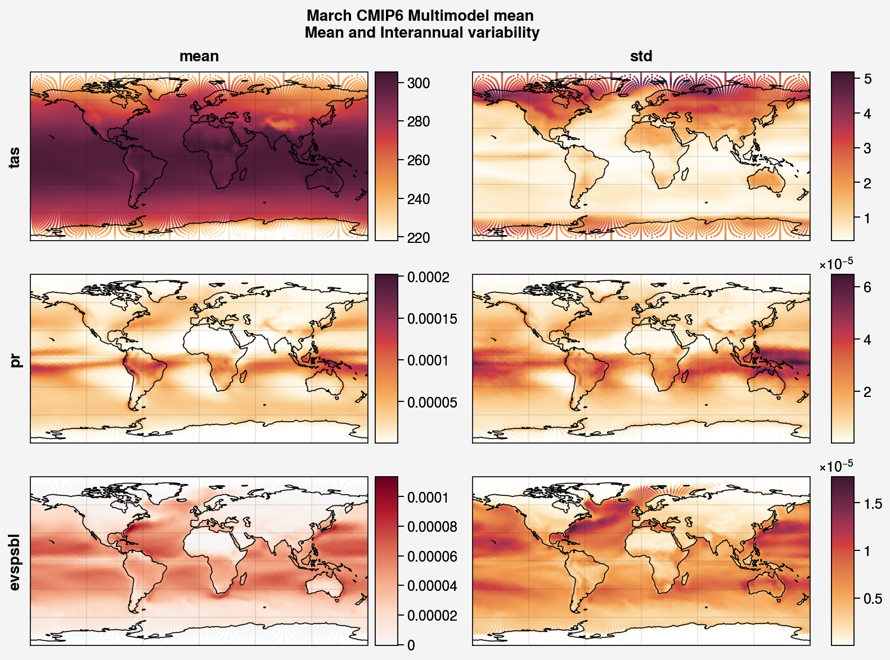

.. _aibedo_physics:

Physics Constraints
===================
 
To strengthen the generalisability of the AiBEDO model, we include "weak" physics-based constraints on the output to penalize unphysical results from the model.

Constraint 1. **Climate energy budget**
-----------------------------------

In this constraint, the energy is budgeted between the heat storage and radiative fluxes at TOA on timescales over which atmospheric energy storage is minimal. This constraint is related to the energy budget used to calculate the transient climate sensitivity (e.g. Bitz et al., 2012).
 
.. math:: 
  \sum_{t}^{> 1 yr} \sum_{lat=90S}^{90N}\sum_{lon=180W}^{180E}(\Delta {R^{TOA}_{lat, lon}} - \lambda_{ECS}\Delta T_{lat, lon}\Delta A_{lat, lon}) = 0

where :math:`\Delta R^{TOA}` is heat storage/top of atmosphere radiative imbalance, :math:`\lambda_{ECS}` feedback constant, :math:`T` is surface temperature and :math:`A` is the area of the cell. 
For the :math:`\lambda_{ECS}` feedback constant, we use the CESM2 equilibrium feedback computed from a 2xCO\ :sub:`2` simulation.
The Planck, water vapour, cloud, and albedo feedbacks are provided as seasonally varying zonal averages. 
We sum all the feedback components together, map across longitude values, and then interpolate to the Sphere-Icosahedral grid.
Constraint 1 applies over longer time scales than the other constraints thus requires several months of data to compute. 
Also, note that we are applying the feedback parameter :math:`\lambda_{ECS}` from one ESM (CESM2) regardless of the source of the training data. 
This weakens the constraint as there is significant uncertainty within CMIP6 in the magnitude of the feedback parameter (Zelinka et al., 2020).

..
	Constraint 2. **Tropical atmospheric energy budget**
	~~~~~~~~~~~~~~~~~~~~~~~~~~~~~~~~~~~~~~~~~~~~~~~~~~~~~~~~~~~~~
	This atmospheric budget balances the contributions from upward net radiative heat flux at the TOA and SFC to the heat convergence in the tropics (Muller and O'Gorman, 2011)).

	.. math:: 

  	\sum_{lat=30N}^{30N} \sum_{lon=180W}^{180E}(LP - R_{TOA} + R_{SFC} + SH + Q)_{lat,lon} \Delta A_{lat, lon} = 0   

	where :math:`L` is the latent heat of vaporization (:math:`2.4536 10^6` J/kg), :math:`P` is the precipitation, :math:`SH` is the sensible heat flux, :math:`R_{TOA}` is the upwelling surface radiation, :math:`R_{TOA}` is the upwelling surface radiation, and :math:`Q` is the convergence of vertically integrated dry static energy (DSE) flux.
	Functionally, :math:`R^{TOA}` and :math:`R^{SFC}` can be calculated as the sum of the long wave and shortwave radiation at the top of atmosphere (TOA) and surface (SFC).
	:math:`Q` is computed at each grid cell as

	.. math:: 
  	Q = -\frac{1}{g}\nabla \cdot \sum_{p=0}^{p_s} (c_p T + g Z) \vec{u} \Delta p

	which is the horizontal convergence of heat energy into the grid cell and balances the radiation and heat fluxes into the cell. 
	As we only use monthly mean data, we do not have information about the sub-monthly covariance of the variables used to compute :math:`Q`, thus the balance only holds assuming this sub-monthly covariability (A.K.A. "transient eddy" effects) are negligible. 
	This is approximately true in tropical regions, where mean flow dominates, but does not hold in the subtropics and poleward, where transient eddies play a much larger role.
	Thus, we compute this constraint only in the tropics.

Constraint 2. **Precipitation energy budget**
---------------------------------------------
This is the energetic constraint on global precipitation. Globally mean radiative cooling of the atmosphere must be balanced by warming of atmosphere due to latent heat flux and sensible heat flux from the surface (Allen and Ingram, 2002; Jakob et al., 2019). Considering hemispheric asymmetries and seasonal cycle this budget can be written as follows - 

.. math:: 
  \sum_{lat=90S}^{90N} \sum_{lon=180W}^{180E} (PL + SH + R_{TOA} -R_{SFC})_{lat,lon} \Delta A_{lat,lon} = L\int_{lat=90S}^{90N} \int_{lon=180W}^{180E} \frac{-1}{g}\frac{\partial}{\partial t} \sum_{lev = 0}^{p_s} q_{lev,lat,lon} dp \Delta A_{lat,lon} = \frac{-L}{g} \frac{d}{dt} Q_{tot}

where :math:`L` is the latent heat of vaporization (2.4536106 J/kg), :math:`P` is the precipitation, :math:`SH` is the sensible heat flux, :math:`R_{TOA}` is the net radiation at top of the atmosphere and :math:`R_{SFC}` is the net surface radiation. We approximate the right hand side term using, :math:`\epsilon_E` which is the climatological :math:`\sum_{lat=90S}^{90N} \sum_{lon=180W}^{180E} (PL + SH + R_{TOA} -R_{SFC})_{lat,lon} \Delta A_{lat,lon}`.

Constraint 3. **Global moisture budget**
----------------------------------------
This relationship balances the moisture flux in to (evaporation) and out of (precipitation) the atmosphere with the change in atmospheric moisture content over the globe at each time step, thus ensuring conservation of moisture in the atmosphere.

.. math:: 
  \sum_{lat=90S}^{90N} \sum_{lon=180W}^{180E} (P-E)_{lat,lon} \Delta A_{lat,lon} = \int_{lat=90S}^{90N} \int_{lon=180W}^{180E} \frac{-1}{g}\frac{\partial}{\partial t} \sum_{lev = 0}^{p_s} q_{lev,lat,lon} dp \Delta A_{lat,lon} = \frac{-1}{g} \frac{d}{dt} Q_{tot}

where :math:`P` is the precipitation, :math:`E` is the evaporation, :math:`q` is the specific humidity, and :math:`p_s` is the surface pressure.

Currently, we approximate the moisture storage term as the climatological mean global mean :math:`P-E`, which we subtract from the :math:`P-E` we calculate for a given month of AiBEDO output such that

.. math:: 
  \sum_{lat=90S}^{90N} \sum_{lon=180W}^{180E} (P-E)_{lat,lon} \Delta A_{lat,lon} - \epsilon_q \approx 0

where :math:`\epsilon_q` is the climatological :math:`\sum_{lat=90S}^{90N} \sum_{lon=180W}^{180E} (P-E)_{lat,lon} \Delta A_{lat,lon}`. However in future work we plan to explicitly include the moisture storage term in the constraint.

Constraint 4. **Non-negative precipitation**
--------------------------------------------
A simple yet relevant constraint is to ensure negative precipitation (:math:`P`) values are set to zero during model training. This will then ensure maximum penalty for the erring grid point when compared to the ground truth data.

.. math:: 
  P \ge 0, lat \in [90S, 90N], lon \in [180E, 180W]

Constraint 5. **Global atmospheric mass budget**
------------------------------------------------
Using the hydrostatic balance assumption, surface pressure can be used as a proxy for the mass of the atmosphere. This simple constraint ensures atmospheric mass conservation summed over the globe for monthly mean data.

.. math:: 
   \sum_{lat=90S}^{90N}\sum_{lon=190W}^{180E}(P_s)_{lat,lon} \Delta A_{lat, lon} = C + \sum_{t} \sum_{lat=90S}^{90N}\sum_{lon=190W}^{180E}(M)_{lat,lon} \Delta A_{lat, lon}

where :math:`P_s` is the surface pressure and :math:`M` is the mass flux into the atmosphere. We assume that the mass flux into the atmosphere is predominantly water vapour, such that we can assume :math:`M = P - E` and the constant :math:`C` is the mass of the dry atmosphere.

The time integrated :math:`P-E` is equivalent to the mass of water vapour in the atmosphere, which we estimate as

.. math:: 
  Q_{tot} = \int_{lat=90S}^{90N} \int_{lon=180W}^{180E} \frac{-1}{g} \sum_{lev = 0}^{p_s} q_{lev,lat,lon} dp

Thus,    

.. math:: 
  \sum_{lat=90S}^{90N}\sum_{lon=190W}^{180E}(P_s)_{lat,lon} \Delta A_{lat, lon} = C + g Q_{tot}

Similar to constraint 3, we currently assume some :math:`C + M_q` can be approximated by the climatological mean :math:`P_s`, which we subtract from the :math:`P_s` for a given month of AiBEDO output such that

.. math:: 
  \int_A \frac{-1}{g}p_s dA - (C + \epsilon_E) = 0

where :math:`C + \epsilon_E` is the climatological average of :math:`\int_A \frac{-1}{g}p_s dA`. However in future work we plan to explicitly include the moisture storage term in the constraint.

Denormalizing
~~~~~~~~~~~~~~~
As the AiBEDO model deals with normalized variables while the constraint require the variables in their original units (and with physically realistic spatial variations), we must "denormalize" the model output to apply the constraints.
The training data fed into the model is detrended and deseasonalized, thus filtering out all low frequency information. However, the climatology and variability change as anthropogenic climate change intensifies.
Furthermore, the data is derived from a range of models with differing mean climatology and interannual variability patterns.
Thus, passing through the climatology and variability associated with the model and time period of training time step provides additional information about model uncertainty and GHG forced climate change that is undesirable when training in a Fluctuation Dissipation framework.
As a result, we select a single reference climatology and variability with which to denormalize the model output for calculating constraints.
This reference can thus be thought to represent the climatology and variability of the AiBEDO model.

We select the CMIP6 multi-ESM ensemble average climatology and variability for the denormalization (though we might equally consider using reanalysis data). 
The average variability is computed as the square root of the average of the interannual variances across the ESMs.
Note that we must still deal with a seasonal cycle in the climatology. A simple approach is to use a single month or season as the basis for the denormalization. More sophisticated methods of incorporating seasonal information are currently under consideration.

	Figure 4. March climatology and interannual variability in the CMIP6 multi-model average.
References
-----------
Allen, M. R., & Ingram, W. J. (2002). Constraints on future changes in climate and the hydrologic cycle. Nature, 419(6903), 228-232.

Bitz, C. M., Shell, K. M., Gent, P. R., Bailey, D. A., Danabasoglu, G., Armour, K. C., Holland M. M. & Kiehl, J. T. (2012). Climate sensitivity of the community climate system model, version 4. Journal of Climate, 25(9), 3053-3070.

Jakob, C., Singh, M. S., & Jungandreas, L. (2019). Radiative convective equilibrium and organized convection: An observational perspective. Journal of Geophysical Research: Atmospheres, 124(10), 5418-5430.

Muller, C. J., & O’Gorman, P. A. (2011). An energetic perspective on the regional response of precipitation to climate change. Nature Climate Change, 1(5), 266-271.

Zelinka, M. D., Myers, T. A., McCoy, D. T., Po‐Chedley, S., Caldwell, P. M., Ceppi, P., Klein, S.A. & Taylor, K. E. (2020). Causes of higher climate sensitivity in CMIP6 models. Geophysical Research Letters, 47(1), e2019GL085782.

