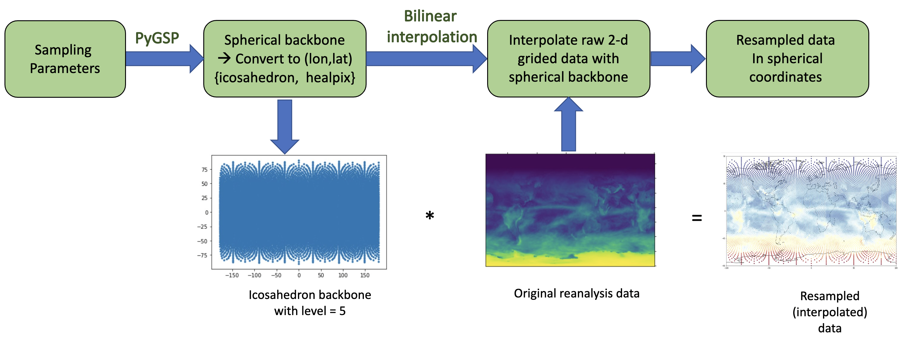

.. _aibedo_architecture:

Preprocessing and Spherical Grid
================================

Detrend, Deseasonalize and Normalize
---------------------------------------

Our preprocessing code respository can be found `here <https://github.com/kramea/aibedo/tree/preprocessing_march2022/preprocessing>`__ that consists of several scripts to preprocess various Earth System Model ensembles. For example, the following code block shows a simple method to preprocess CESM2-WACCM model ensemble:

.. code-block:: python

    import preprocessing

    #activity = 'CMIP'
    #experiment = 'historical'

    activity = 'ScenarioMIP'
    experiment = 'ssp585'
    institute = 'NCAR'
    modelName = 'CESM2-WACCM'

    for member in ['r2i1p1f1','r3i1p1f1']:
        #member = 'r1i1p1f1'
        preprocessing.preprocess_input(activity, experiment, modelName, institute, member)
        preprocessing.preprocess_output(activity, experiment, modelName, institute, member)

Running this script preprocesses the model data to detrend, deseasonalize and normalize (detailed in Datasets section). We have provided similar high-level scripts for the selected ESM models we are using in our training data.

Interpolate 2D-gridded data to Spherical Grids
----------------------------------------------

We use ``pygsp`` package to interpolate 2D-gridded data into a spherical grid format. This is done in two steps:

**Step 1:** Generate a text file ("skeleton") with the desired Icosahedral level using our python script (`link here <https://github.com/kramea/aibedo/blob/preprocess_MS3/preprocessing/gen_icosph_gridfile.py>`__). The code block is also shown below:

.. code-block:: python

    import pygsp as pg
    import numpy as np

    ### Generates a text file with centre points of a icosahedral sphere grid
    ### Formatted to pass as an argument for 'cdo remap,GRIDFILE in.nc out.nc'

    def xyz2lonlat(x:float,y:float,zLfloat, radius=6371.0e6):
        """From cartesian geocentric coordinates to 2D geographic coordinates."""
        """ lon: [-180, 180], lat:[-90, 90] """
        latitude = np.arcsin(z / radius)/np.pi*180
        longitude = np.arctan2(y, x)/np.pi*180
        return longitude, latitude

    def gen_icosphere(level:int,radius:float = 6371.0e6):
        '''
        Generates points on a icosphere grid (from Soo Kim)
        level (int): iteration level
        radius (float): radius of the earth
        '''
        #(1) generate graph of SphereIcosahedral
        graph = pg.graphs.SphereIcosahedral(2**level)
        #(2) extract lon, lat coordinate
        vertices = graph.coords # xyz coordinates
        #print("number of vertices for level "+str(level)+" (2**"+str(level)+")is "+str(graph.n_vertices))
        lon = []
        lat = []
        radius = 1
        # convert cartesian points to spherical lon/lat
        for tmp_xyz in vertices:
            tmp_lon, tmp_lat = xyz2lonlat(tmp_xyz[0],tmp_xyz[1],tmp_xyz[2], radius=radius)
            lon.append(tmp_lon)
            lat.append(tmp_lat)
        return lon, lat

    sphlevel = 6

    lon,lat = gen_icosphere(sphlevel,radius = 6371.0e6)

    f = open("isosphere_{0}.txt".format(sphlevel), "a")

    # write grid to file
    f.write("gridtype = unstructured\n")
    f.write("gridsize = {0}\n".format(len(lon)))
    f.write("# Longitudes\n")
    f.write("xvals = " + ' '.join(map(str, lon))+"\n")
    f.write("# Latitudes\n")
    f.write("yvals = " + ' '.join(map(str, lat))+"\n")

This code block generates a text file that will be used to generate the spherical sample for level 6. To generate a text file for another grid level, please change the ``sphlevel`` in the code.

**Step 2:** Once the text file is generated in step 1, we use the ``cdo`` (Climate Data Operator) command line tool to generate the interpolated ``netCDF`` file. Please see `here <https://www.isimip.org/protocol/preparing-simulation-files/cdo-help/>`__ for instructions to download ``cdo``.

The following script is given in command line to generate the interpolated file for model training:

``cdo remapbil,icosphere_6.txt in.nc out.nc``

Here, ``in.nc`` is the 2D-gridded file from ESM model ensembles or Reanalysis datasets, and ``out.nc`` is the name of the interpolated file that will be used for model training.

Sampling Module
~~~~~~~~~~~~~~~

Typically, models use climate data in a uniform 2D rectangular gridded pattern. While this may suffice local/regional modeling attributes, they do not capture the physical/geodesy properties of the Earth, particularly as the focus moves away from the equator. For this reason, we developed a geodesy-aware sampling that converts 2D rectangular gridded coordinates to a geodesic grid type. There are several ways a geodesic grid can be manifested. Our method allows the modeler to choose the target gridding type between two such mesh types: (a) Icosahedral, (b) Healpix.

*Icosahedral Grids:* Icosahedral grids consist of a certain number of equiangular triangles to form a convex polygon, called Icosahedron. The triangles are formed by equally spaced grid points to form a sphere. The number of grid points are defined by their **levels** as shown in the following equation:

.. image::
	images/icoeq.png

Here, g refers to the grid level we want to generate the mesh for, and N refers to the number of points
in the grid that forms the icosahedron.

.. figure::
	images/icoshLevels.png
  :scale: 50 %

  Figure 3. Illustration of Icosahedral meshes for different levels

.. list-table:: Table 1. Icosahedral Levels, Vertices and Spatial Resolution
   :widths: 20 20 20
   :header-rows: 1

   * - Levels
     - Vertices
     - Resolution
   * - 1
     - 42
     - 3520 km
   * - 2
     - 162
     - 1760 km
   * - 3 
     - 642 
     - 880 km
   * - 4
     - 2562
     - 440 km
   * - 5
     - 10242
     - 220 km
   * - 6
     - 40962
     - 110 km

*Healpix Grids:* Healpix is a curvilinear partition grid type made up of equal area quadrilaterals. Unlike icosahedral grids, they are manifested as pixels, and the total number of pixels in a Healpix grid is calculated as follows:

.. image::
	images/healpixeq.png

Here P is the number of pixels in the Healpix grid, and S is the grid sub-division or resolution param-
eter. Healpix is constructed in such a way that the areas of each pixel for a given sub-division is equal.

.. figure::
	images/healpixMesh.png
  :scale: 25 %

  Figure 4. Illustration of Healpix meshes for different Subdivisions

.. list-table:: Table 2. Healpix Subdivisions, Vertices and Spatial Resolution
   :widths: 20 20 20
   :header-rows: 1

   * - Subdivisions
     - Vertices
     - Resolution
   * - 4
     - 192
     - 2497 km
   * - 8
     - 768
     - 1248 km
   * - 16
     - 3072
     - 6124 km
   * - 32
     - 12288
     - 312 km
   * - 64
     - 49152
     - 156 km
   * - 128
     - 196608
     - 78 km

Interpolation Module
~~~~~~~~~~~~~~~~~~~~

We use the PyGSP library in Python to perform the grid transformation. It is commonly used for various graph operations to use in signal processing or social network analysis (e.g., Erdos-Reyni network). We first develop a 'backbone' structure of a spherical coordinate system (icosahedron, healpix, etc.). The properties of the spherical coordinates, such as levels or sub-divisions, are given as input. At this point, the coordinates are simply graph networks. In the next step, we assign latitude and longitude values to the graph network (x, y) so that they can be manifested in a geographical coordinate system. Finally, we use the raw data from reanalysis or ESM output and perform bilinear interpolation to obtain the final spherically-sampled data. 

  Figure 5. Pipeline to convert from 2D grid to Spherical grid

.. figure::
	images/interpolated.png

  Figure 6. Spherical sampled and interpolated dataset from 2D-linearly gridded data
